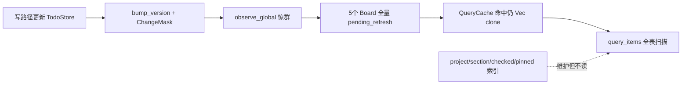

=# 去冗余与热路径性能优化

## 现状结论

最大问题不是缺少优化代码，而是**设施建了却未接到热路径**：

核心热点文件：

- `[crates/mytool/src/core/state/store.rs](crates/mytool/src/core/state/store.rs)` — 索引未读、`label_index` 重建漏 clear、`items_by_label` 二次线性查找
- `[crates/mytool/src/core/state/cache.rs](crates/mytool/src/core/state/cache.rs)` — `get_*` 每次 `.clone()` 整表
- `[crates/mytool/src/ui/views/boards/board_*.rs](crates/mytool/src/ui/views/boards)` — 观察者忽略 `ChangeMask`；`[board_base.rs](crates/mytool/src/ui/views/boards/board_base.rs)` 已有 `todo_store_version_and_mask` 但未使用且用了破坏性 `take`
- `[crates/mytool/src/core/state/events.rs](crates/mytool/src/core/state/events.rs)` — `BatchOperations` 仅 `state_init` 注册、无读写
- `[crates/mytool/src/core/actions/operation_merger.rs](crates/mytool/src/core/actions/operation_merger.rs)` / `[batch.rs](crates/mytool/src/core/actions/batch.rs)` — 模块外无调用方
- `[crates/mytool/src/ui/views/item/](crates/mytool/src/ui/views/item)` — 旧 `ItemsPanel` 系列，主路径已用 `BoardPanel`

**本次范围固定为 P0+P1**（热路径 + 明显死代码）。不包含：拆 `item_info.rs`、删 deprecated Repository、收缩 `todos::Store` 透传、全面清理 `objects/filters`（列为后续）。

---

## P0：热路径正确性与性能

### 1. 修复并真正使用 TodoStore 索引

在 `[store.rs](crates/mytool/src/core/state/store.rs)`：

- `rebuild_indexes_impl`：**补上 `label_index.clear()`**；用下标/`take` 避免 `all_items.clone()`。
- 新增 `id_map: HashMap<String, Arc<ItemModel>>`，在 add/remove/replace/rebuild 时同步维护。
- 读路径改走索引：
  - `items_by_project` / `items_by_section` → `project_index` / `section_index`（再按需 filter checked）
  - `completed_items` / `pinned_items` → `checked_set` / `pinned_set` + `id_map`
  - `items_by_label` → `label_index` + `id_map`（去掉对每个 id 的 `all_items.iter().find`）
- `inbox_items` / `today_items` / `scheduled_items` / `overdue_items` 仍可全表谓词（语义依赖 due/project 组合）；靠下面的 Arc 缓存消化重复计算。

### 2. QueryCache 命中近似 O(1)

在 `[cache.rs](crates/mytool/src/core/state/cache.rs)` 与 `*_items_cached`：

- 缓存值类型改为 `Arc<Vec<Arc<ItemModel>>>`（或 `Arc<[Arc<ItemModel>]>`）。
- `get_*` 返回 `Option<Arc<...>>`（克隆 Arc，不克隆 Vec）。
- 调用方（Board）改为接受 `Arc` 或 `&[Arc<_>]`，避免二次 `items.clone()`。

### 3. Board 用 ChangeMask 过滤惊群

- 修正 `bump_version`：当真正 `version += 1` 时先 `change_mask = ChangeMask::none()`，再由调用方置位；同一 50ms 窗口内跳过 version 时继续 OR 合并掩码。这样多 Board 可安全 `peek`，掩码不会永远 sticky。
- 各 Board 的 `lazy_init_observer`：`peek_change_mask().affects_inbox/today/...()` 为 false 则直接 return，不设 `pending_refresh`。
- `[board_base.rs](crates/mytool/src/ui/views/boards/board_base.rs)`：`todo_store_version_and_mask` 改为 `peek`（或返回拷贝），禁止多观察者场景下 `take` 清掉别人的掩码。
- `DirtyFlags` / `ObserverRegistry`：本轮不扩展精细到单条 item 的过滤（`ChangeMask` 已能挡住纯 project/section/label 元数据变更）；保持现状，避免双轨。

### 4. 小修：`get_label_stats` N+1

`[label_service.rs](crates/todos/src/services/label_service.rs)` 的 `get_label_stats`：改为一次 `Id.is_in` / `batch_load` 拉齐 items，再内存聚合。

---

## P1：去冗余、提高内聚

### 5. 抽取 Board 观察者/刷新模板

在 `BoardBase` 增加辅助（例如 `should_refresh_for_mask` + 统一的 pending 应用骨架），五个 `board_inbox/today/pin/scheduled/completed` 删掉复制粘贴的 `lazy_init_observer` / `apply_pending_refresh` 样板。`board_inbox` 去掉对已 cached 未完成列表的重复 `!checked` filter。

### 6. 删除未接线死代码

- 删除 Global `BatchOperations` 及其在 `[state/mod.rs](crates/mytool/src/core/state/mod.rs)` 的 `set_global`（保留真正使用中的 optimistic / `BatchQueue` 需再确认：当前 `BatchQueue`/`OperationMerger` 模块外无引用 → **一并移除** `operation_merger.rs`、`batch.rs` 及 `actions/mod.rs` 导出）。
- 删除 `[ui/views/item/](crates/mytool/src/ui/views/item)` 旧面板模块（`ItemsPanel` 等），从 `views/mod.rs` 去掉 `mod item`（确认无 story/测试引用后删）。
- `TodoEventBus`：保留为调试历史，但把 `remove(0)` 换成 `VecDeque`；不扩展假 pub/sub。乐观更新里的 `publish` 可保留（调试用），不新增订阅。

### 7. 卫生项（顺手、低风险）

- 删除 `[todos/src/main1.rs](crates/todos/src/main1.rs)`（若存在且非入口）。
- 不为本期收紧 `#![allow(dead_code)]`（避免引爆大范围警告）；记入后续。

---

## 验证

- `cargo test -p mytool`（若有 store/cache/board 单测）+ `cargo test -p todos`
- `cargo build -p mytool`（MSYS2/gnu 工具链）
- 手动冒烟：Inbox/Today/Pinned 增删改、改项目名（应不触发无关 Board 列表重建）、标签视图无重复条目

## 预期收益

| 改动              | 收益                               |
| --------------- | -------------------------------- |
| 索引真正读取 + id_map | 项目/标签/完成/置顶查询从 O(n)～O(n²) → O(k) |
| QueryCache Arc  | 缓存命中不再整表分配                       |
| ChangeMask 过滤   | 元数据变更不再惊群 5+ Board               |
| 删死代码 + Board 模板 | 少维护数千行重复/双轨逻辑                    |

