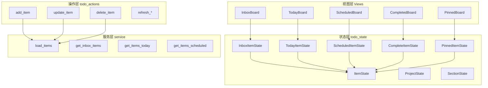
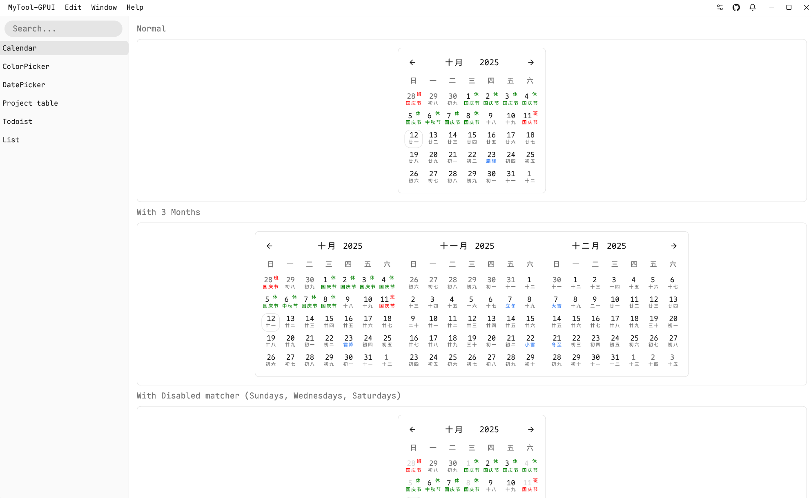

# Mytool-GPUI

## 当前架构预览




## toolchain

x86_64-pc-windows-gnu

## gcc 1.15 编译问题

1. syntect： 改为使用rust实现的正则

```bash
syntect = { version = "5.2", default-features = false, features = [
    "default-fancy",
] }
```

2. gpui.rc问题
   回退Msys2到13.2.0

```bash
# 下载旧版本包
wget https://repo.msys2.org/mingw/x86_64/mingw-w64-x86_64-gcc-13.2.0-1-any.pkg.tar.zst
wget https://repo.msys2.org/mingw/x86_64/mingw-w64-x86_64-gcc-libs-13.2.0-1-any.pkg.tar.zst

# 强制降级
pacman -U --nodeps --force mingw-w64-x86_64-gcc-13.2.0-1-any.pkg.tar.zst
pacman -U --nodeps --force mingw-w64-x86_64-gcc-libs-13.2.0-1-any.pkg.tar.zst

# 锁定版本
echo "IgnorePkg = mingw-w64-x86_64-gcc mingw-w64-x86_64-gcc-libs" >> /etc/pacman.conf
```

## 批量修复

```bash
### 删除未使用的依赖项
cargo install cargo-machete && cargo machete
### 格式化
#### 全部格式化
cargo fmt --all && cargo clippy --fix --allow-dirty --allow-staged

####
# 仅检查修改过的文件（配合git）
git diff --name-only --diff-filter=ACM | grep '\.rs$' | xargs cargo clippy --fix

# 按严重程度分级处理
cargo clippy -- -D clippy::correctness # 先解决正确性问题
cargo clippy -- -W clippy::style       # 再处理风格问题

### 按目录修复
cargo clippy --fix --lib -p todos --allow-dirty
cargo clippy --fix --lib -p mytool --allow-dirty

```

## 代码修复流程

```bash
# 1. 先格式化代码
cargo fmt

# 2. 尝试自动修复所有 Clippy 警告
cargo clippy --fix

# 3. 检查剩余的 style 警告
cargo clippy -- -W clippy::style

# 4. 手动修复不能自动修复的
#    - 使用 IDE 的快速修复
#    - 或者根据建议手动修改

# 5. 再次检查
cargo clippy -- -W clippy::style
```

## 示例

中文日历

planify 类似界面 - 开发中...
