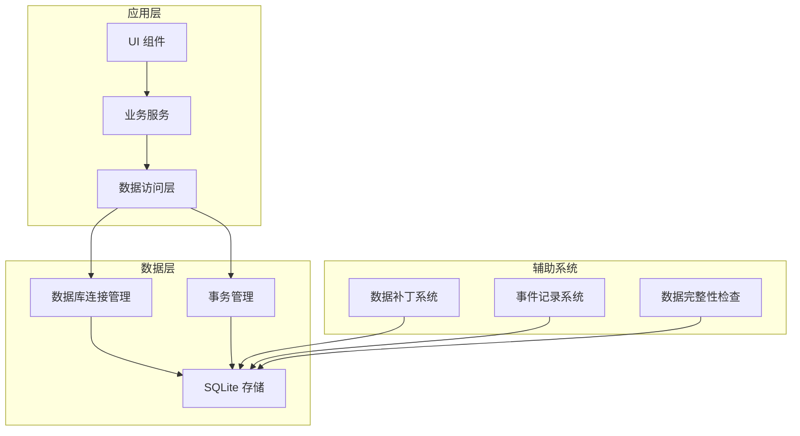

# 数据保存机制重新设计方案

## 1. 项目分析

### 1.1 当前项目（MyTool-GPUI）

- **技术栈**：Rust + GPUI + Sea-ORM + SQLite
- **现有机制**：
  - 使用 Sea-ORM ORM 框架管理数据库操作
  - 支持 SQLite 本地存储和网络数据库
  - 有基本的连接池配置和 WAL 模式优化
  - 实现了 Item-Label 关联表
  - 有重试机制和错误处理

### 1.2 参考项目（Planify）

- **技术栈**：Vala + SQLite
- **核心优势**：
  - 完整的数据库初始化和补丁系统
  - 详细的触发器系统用于事件记录
  - 健壮的数据完整性检查
  - 清晰的表结构和字段管理
  - 支持多源数据同步

## 2. 设计目标

1. **提高数据可靠性**：增强数据完整性和一致性
2. **优化性能**：改进数据库操作效率
3. **简化维护**：统一数据操作接口
4. **增强扩展性**：支持未来功能扩展
5. **保持兼容性**：确保现有数据结构兼容

## 3. 核心设计

### 3.1 架构设计



### 3.2 关键组件设计

#### 3.2.1 数据库连接管理器

- **功能**：统一管理数据库连接，支持连接池和自动重连
- **特性**：
  - 智能连接池配置（根据数据库类型自动调整）
  - 连接状态监控和健康检查
  - 自动重试机制
  - 连接超时处理

#### 3.2.2 数据补丁系统

- **功能**：管理数据库架构升级
- **特性**：
  - 版本化补丁管理
  - 自动检测和应用补丁
  - 回滚机制
  - 补丁执行状态跟踪

#### 3.2.3 事务管理器

- **功能**：确保数据操作的原子性
- **特性**：
  - 嵌套事务支持
  - 自动提交和回滚
  - 事务超时处理
  - 并发控制

#### 3.2.4 事件记录系统

- **功能**：记录数据变更事件
- **特性**：
  - 基于触发器的自动事件记录
  - 事件类型分类
  - 事件查询和分析

  - 历史记录管理

#### 3.2.5 数据完整性检查器
- **功能**：确保数据库完整性
- **特性**：
  - 定期完整性检查
  - 表结构验证
  - 外键约束检查
  - 数据一致性验证

## 4. 实现方案

### 4.1 数据库连接管理

```rust
// crates/todos/src/app/database.rs
pub struct DatabaseManager {
    connections: Arc<RwLock<HashMap<String, DatabaseConnection>>>,
    config: DatabaseConfig,
}

impl DatabaseManager {
    pub async fn get_connection(&self, db_type: &str) -> Result<DatabaseConnection, DbErr> {
        // 实现连接获取逻辑
    }
    
    pub async fn health_check(&self) -> Result<bool, DbErr> {
        // 实现健康检查
    }
}
```

### 4.2 数据补丁系统

```rust
// crates/todos/src/app/patch.rs
pub struct PatchManager {
    db: Arc<DatabaseConnection>,
    patches: Vec<Patch>,
}

impl PatchManager {
    pub async fn apply_patches(&self) -> Result<(), DbErr> {
        // 实现补丁应用逻辑
    }
    
    pub async fn get_current_version(&self) -> Result<i32, DbErr> {
        // 获取当前数据库版本
    }
}
```

### 4.3 事务管理

```rust
// crates/todos/src/app/transaction.rs
pub struct TransactionManager {
    db: Arc<DatabaseConnection>,
}

impl TransactionManager {
    pub async fn execute<T, F>(&self, operation: F) -> Result<T, DbErr>
    where
        F: Fn(&DatabaseConnection) -> Future<Output = Result<T, DbErr>>,
    {
        // 实现事务执行逻辑
    }
}
```

### 4.4 数据访问层优化

```rust
// crates/todos/src/repositories/base_repository.rs
pub trait BaseRepository<T: ActiveModelTrait> {
    async fn find_by_id(&self, id: &str) -> Result<T::Model, TodoError>;
    async fn create(&self, model: T) -> Result<T::Model, TodoError>;
    async fn update(&self, model: T) -> Result<T::Model, TodoError>;
    async fn delete(&self, id: &str) -> Result<(), TodoError>;
}
```

### 4.5 事件记录系统

```rust
// crates/todos/src/services/event_recorder.rs
pub struct EventRecorder {
    db: Arc<DatabaseConnection>,
}

impl EventRecorder {
    pub async fn record_event(
        &self,
        event_type: &str,
        object_id: &str,
        object_type: &str,
        object_key: &str,
        old_value: Option<&str>,
        new_value: Option<&str>,
    ) -> Result<(), DbErr> {
        // 实现事件记录逻辑
    }
}
```

## 5. 表结构优化

### 5.1 现有表结构
- **Labels**：标签表
- **Projects**：项目表
- **Sections**：分区表
- **Items**：任务表
- **Reminders**：提醒表
- **Attachments**：附件表
- **OEvents**：事件表
- **Sources**：数据源表
- **item_labels**：任务-标签关联表

### 5.2 优化建议

1. **添加索引**：
   - 为常用查询字段添加索引
   - 优化复合索引

2. **字段优化**：
   - 统一时间字段格式
   - 优化布尔字段存储
   - 增加必要的外键约束

3. **新增表**：
   - **db_version**：记录数据库版本
   - **sync_log**：同步日志
   - **user_preferences**：用户偏好设置

## 6. 性能优化策略

1. **连接池优化**：
   - 根据系统资源动态调整连接数
   - 实现连接生命周期管理

2. **查询优化**：
   - 预编译语句
   - 批量操作
   - 延迟加载

3. **缓存策略**：
   - 实现二级缓存
   - 缓存常用查询结果
   - 缓存失效机制

4. **并发控制**：
   - 乐观锁
   - 悲观锁
   - 事务隔离级别优化

## 7. 数据安全

1. **备份机制**：
   - 自动备份
   - 增量备份
   - 备份恢复

2. **数据加密**：
   - 敏感数据加密
   - 加密存储

3. **访问控制**：
   - 权限管理
   - 访问审计

## 8. 迁移策略

1. **数据迁移**：
   - 现有数据结构兼容
   - 平滑迁移流程

2. **版本管理**：
   - 数据库版本控制
   - 应用版本与数据库版本匹配

## 9. 测试计划

1. **单元测试**：
   - 数据库操作测试
   - 事务测试
   - 补丁测试

2. **集成测试**：
   - 完整流程测试
   - 性能测试
   - 并发测试

3. **压力测试**：
   - 大数据量测试
   - 高并发测试
   - 长时间运行测试

## 10. 实施步骤

1. **阶段一**：基础架构搭建
   - 实现数据库连接管理器
   - 实现数据补丁系统
   - 实现事务管理器

2. **阶段二**：核心功能实现
   - 优化数据访问层
   - 实现事件记录系统
   - 实现数据完整性检查

3. **阶段三**：性能优化
   - 实施缓存策略
   - 优化查询性能
   - 测试和调优

4. **阶段四**：安全与备份
   - 实现备份机制
   - 实现数据加密
   - 安全测试

5. **阶段五**：部署与监控
   - 部署到生产环境
   - 监控系统搭建
   - 故障处理机制

## 11. 预期成果

1. **数据可靠性提升**：
   - 数据完整性保障
   - 事务一致性
   - 错误恢复能力

2. **性能提升**：
   - 查询速度优化
   - 并发处理能力增强
   - 资源使用效率提高

3. **维护性提升**：
   - 代码结构清晰
   - 易于扩展
   - 便于调试和监控

4. **用户体验提升**：
   - 响应速度更快
   - 操作更流畅
   - 数据更安全

## 12. 风险评估

1. **潜在风险**：
   - 数据迁移失败
   - 性能回归
   - 兼容性问题

2. **缓解措施**：
   - 详细的迁移计划
   - 充分的测试
   - 回滚机制
   - 监控系统

## 13. 总结

通过参考 Planify 的数据保存机制，结合当前项目的技术栈，设计了一个更健壮、高效、可维护的数据保存系统。该设计不仅解决了当前系统的痛点，还为未来的功能扩展和性能优化奠定了基础。

实施此方案后，MyTool-GPUI 将拥有更可靠的数据存储能力，更好的性能表现，以及更简洁的代码结构，为用户提供更优质的使用体验。