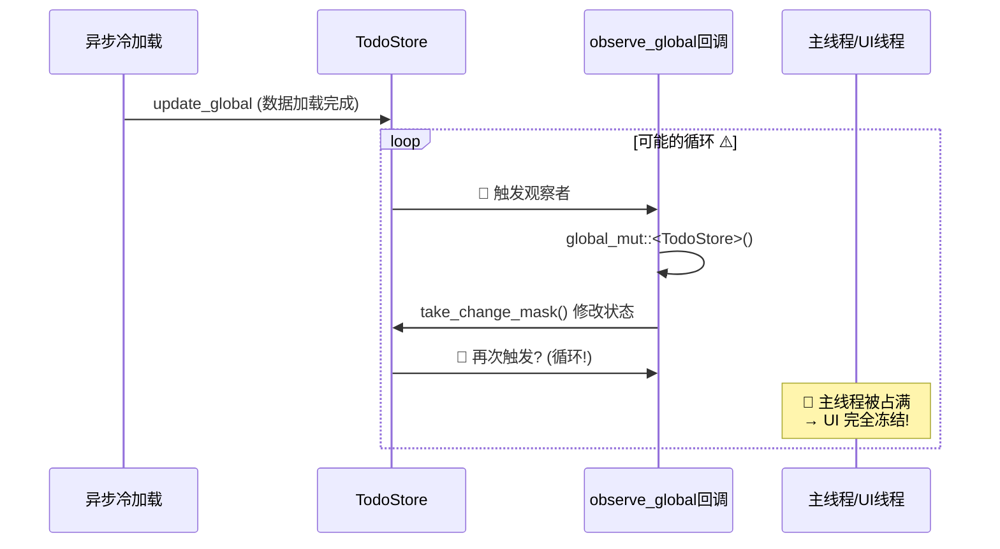
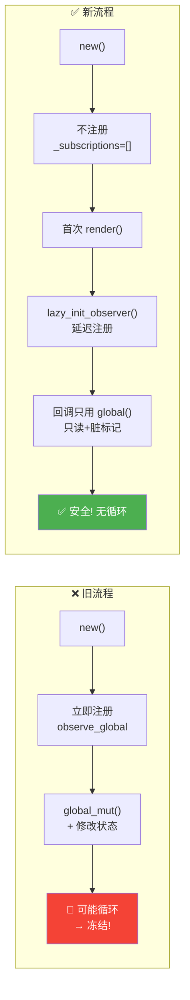

# GPUI 应用主线程冻结排查与修复经验

> **问题日期**: 2026-05-15  
> **应用**: MyTool-GPUI (Rust + GPUI 框架)  
> **状态**: ✅ 已解决

---

## 🎯 问题描述

应用启动后窗口显示出来，但 UI 完全冻结（无法拖动、点击、交互），主线程被阻塞。

---

## 🔍 排查过程（二分法）

### 阶段 1：启动流程验证

| 步骤 | 测试内容 | 耗时 | 结果 |
|------|---------|------|------|
| 1 | 空闭包测试（无任何初始化） | <1ms | ✅ 正常 |
| 2 | `mytool::init(cx)` | 2ms | ✅ 正常 |
| 3 | `state_init(cx, db)` | <1ms | ✅ 正常 |
| 4 | `init_plugins(cx)` | <1ms | ✅ 正常 |
| 5 | `create_new_window()` + Gallery | <1ms | ✅ 正常 |

### 阶段 2：UI 组件二分法

```
5个Story全开 → 🔴 冻结
├── 只留 Welcome → ✅ 正常
├── + Calendar → ✅ 正常
├── + Todo → 🔴 冻结 ← 锁定 TodoStory
│   ├── 最小化 TodoStory（无子组件）→ ✅
│   ├── + BoardPanel → 🔴
│   │   ├── 去掉 BoardPanel.observe_global → 🔴
│   │   ├── 只留前3个Board → 🔴
│   │   ├── 只留 InboxBoard → 🔴
│   │   └── 去掉 InboxBoard.observe_global → ✅ ← 找到元凶！
```

**最终定位**: `InboxBoard` 的 `observe_global::<TodoStore>` 回调导致主线程冻结。

---

## 💥 根本原因分析

### 问题代码模式（❌ 危险写法）

```rust
// 在 new() 中立即注册观察者
pub fn new(window: &mut Window, cx: &mut Context<Self>) -> Self {
    // ...
    base._subscriptions = vec![
        cx.observe_global::<TodoStore>(move |this, window, cx| {
            // ⚠️ 使用 global_mut() 修改全局状态
            let mask = {
                let store = cx.global_mut::<TodoStore>();        // ← 危险！
                this.base.todo_store_version_and_mask(store)      // ← 内部调用 take_change_mask()
            };
            // ... 大量数据更新操作 ...
            cx.notify();
        }),
    ];
}
```

### 冻结机制图解



### 为什么会循环？

1. **`global_mut()`** 获取可变引用并修改了 `TodoStore` 内部状态
2. **`todo_store_version_and_mask()`** 内部调用 `take_change_mask()` 消费变更掩码
3. 这个修改可能间接触发其他观察者或再次触发当前观察者
4. 形成调用链：`observe_global → global_mut → 状态变更 → 触发观察者 → 循环`

---

## ✅ 解决方案：延迟注册 + 只读访问

### 修复后代码模式（✅ 安全写法）

```rust
use std::cell::Cell;

pub struct InboxBoard {
    base: BoardBase,
    observer_id: Option<u64>,
    item_row_ids: Vec<String>,
    pending_refresh: Cell<bool>,
    /// 🚀 标记观察者是否已注册（避免重复）
    observer_registered: Cell<bool>,
}

impl InboxBoard {
    pub fn new(window: &mut Window, cx: &mut Context<Self>) -> Self {
        let mut base = BoardBase::new(window, cx);
        let observer_id = { /* ... */ };

        // 🚀 关键：new() 中不注册观察者！
        base._subscriptions = vec![];

        Self {
            base,
            observer_id,
            item_row_ids: Vec::new(),
            pending_refresh: Cell::new(false),
            observer_registered: Cell::new(false),
        }
    }

    /// 🚀 延迟注册：在首次 render() 时才注册观察者
    fn lazy_init_observer(&self, cx: &mut Context<Self>) {
        if self.observer_registered.get() {
            return; // 已注册，跳过
        }
        self.observer_registered.set(true);

        let _subscription = cx.observe_global::<TodoStore>(move |this, cx| {
            // ✅ 只使用只读访问！不调用 global_mut()！
            let _store = cx.global::<TodoStore>();

            // ✅ 只设置脏标记，让 render() 处理实际更新
            this.pending_refresh.set(true);
            cx.notify();
        });
    }

    /// 🚀 在 render() 开头执行实际的刷新操作
    fn apply_pending_refresh(&mut self, window: &mut Window, cx: &mut Context<Self>) {
        if !self.pending_refresh.get() {
            return;
        }
        self.pending_refresh.set(false);

        // 确保观察者已注册
        self.lazy_init_observer(cx);

        // 执行实际的数据更新逻辑...
        let cache = cx.global::<QueryCache>();
        let state_items = cx.global::<TodoStore>().inbox_items_cached(cache);
        // ... 更新 item_rows 等 ...
    }
}

impl Render for InboxBoard {
    fn render(&mut self, window: &mut Window, cx: &mut Context<Self>) -> impl IntoElement {
        // 🚀 在 render 开头处理待执行的刷新
        self.apply_pending_refresh(window, cx);
        
        // ... 正常渲染逻辑 ...
    }
}
```

### 修复原理对比



---

## 📋 受影响的文件清单

| 文件 | observe_global 数量 | 修复状态 |
|------|-------------------|---------|
| `crates/mytool/src/ui/views/boards/board_inbox.rs` | 1 | ✅ 已修复 |
| `crates/mytool/src/ui/views/boards/board_today.rs` | 2 | ✅ 已修复 |
| `crates/mytool/src/ui/views/boards/board_scheduled.rs` | 2 | ✅ 已修复 |
| `crates/mytool/src/ui/views/boards/board_pin.rs` | 1 | ✅ 已修复 |
| `crates/mytool/src/ui/views/boards/board_completed.rs` | 2 | ✅ 已修复 |

---

## 🛠️ 工具箱：调试技巧

### 技巧 1：文件日志（绕过终端输出问题）

当 `eprintln!` 无输出时，使用文件日志：

```rust
use std::fs::OpenOptions;
use std::io::Write;

const LOG_FILE: &str = "diag_log.txt";

macro_rules! file_log {
    ($($arg:tt)*) => {
        let msg = format!("[{}] {}\n", 
            chrono::Local::now().format("%H:%M:%S%.3f"), 
            format!($($arg)*)
        );
        let mut file = OpenOptions::new()
            .create(true).write(true).append(true)
            .open(LOG_FILE).expect("无法打开日志");
        let _ = file.write_all(msg.as_bytes());
        let _ = file.flush(); // 立即刷盘
    };
}
```

### 技巧 2：二分法快速定位

```
完整系统 → 有问题？
├── 一半功能 → 还有问题？→ 继续缩小
└── 另一半 → 没问题？→ 问题在前半部分
```

### 技巧 3：逐步启用排查

```bash
# 第1步：最小化测试
cargo run  # 只有空闭包

# 第2步：逐步添加组件
# 取消注释 mytool::init → 测试
# 取消注释 state_init → 测试
# ...
```

---

## 📚 经验总结

### GPUI 观察者最佳实践

| 场景 | ❌ 错误做法 | ✅ 正确做法 |
|------|-----------|-----------|
| 注册时机 | 在 `new()` 中立即注册 | 延迟到 `render()` 或首次需要时 |
| 全局状态访问 | 使用 `global_mut()` 修改状态 | 使用 `global()` 只读访问 |
| 数据更新位置 | 在观察者回调中直接更新 | 设置脏标记，在 `render()` 中更新 |
| 回调复杂度 | 重型计算/大量克隆 | 轻量操作（设标记 + notify） |

### 防御性编程检查清单

- [ ] 观察者回调中是否使用了 `global_mut()`？
- [ ] 是否在 `new()` 中注册了 `observe_global`？
- [ ] 回调是否会修改触发自身的全局状态？
- [ ] 是否有多个组件监听同一个 Global 且互相影响？

---

## 🔗 相关概念

- **GPUI**: Zed Industries 开发的 GPU 加速 UI 框架
- **`cx.observe_global`**: 监听全局状态变化的 API
- **`global()` vs `global_mut()`**: 只读 vs 可变访问全局状态
- **脏标记模式 (Dirty Flag)**: 延迟更新的设计模式
- **竞争条件 (Race Condition)**: 多个异步操作同时访问共享资源

---

*本文档记录于 2026-05-15，作为 MyTool-GPUI 项目的技术备忘录。*
