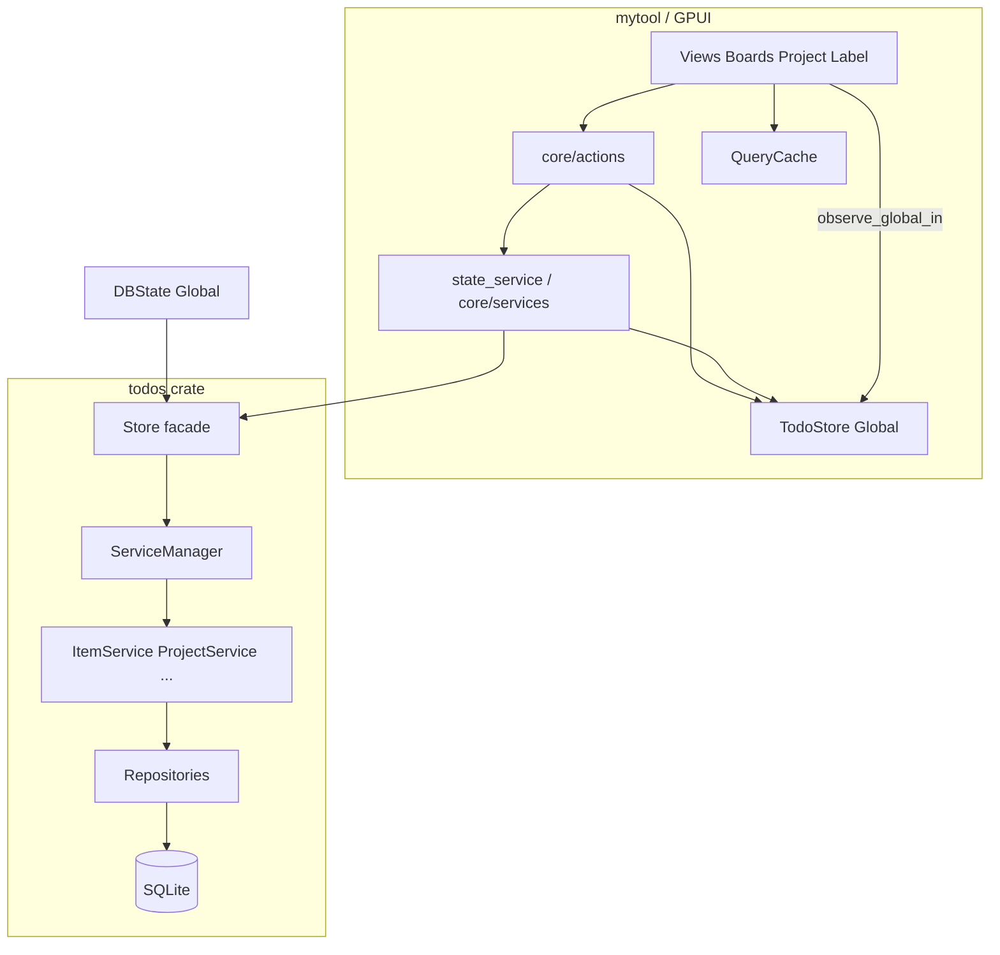

# MyTool-GPUI 项目架构分析

本文从**目录与工程划分**、**数据与业务结构**、**UI 与状态更新链路**等角度梳理当前代码库，便于后续扩展与排障。

---

## 1. 仓库与目录设计

### 1.1 工作区（Cargo Workspace）

根目录 `Cargo.toml` 定义多 crate 工作区：

| 成员 | 角色 |
|------|------|
| `crates/mytool` | 默认成员：GPUI 桌面主程序（UI、快捷键、插件入口） |
| `crates/todos` | 任务领域核心：实体、仓储、服务、`Store` 门面 |
| `crates/gconfig` | 全局配置（数据库路径、日志等），被 `ServiceManager` 读取 |
| `test` | 测试与基准辅助 |

依赖关系可概括为：**mytool → todos / gconfig**；**todos → gconfig**（通过配置初始化数据库与服务）。

### 1.2 主程序源码树（`crates/mytool/src`）

- **`core/`**  
  - `state/`：`DBState`、`TodoStore`、`QueryCache`、`TodoEventBus`、`ObserverRegistry`、`DirtyFlags`、`PendingTasksState` 等 GPUI `Global` 状态。  
  - `actions/`：面向 UI 的写操作入口（如 `item`、`project`、`section`、`batch`），内部调用 `state_service`（即 `core::services`）与 `tokio_runtime`。  
  - `services/`：对 `todos::Store` 的薄封装（`load_*_with_store`、`add_item_with_store` 等），在 `lib.rs` 中以 `state_service` 名重新导出。  
  - 其他：`error_handler`、`shortcuts`、`notification` 等。

- **`ui/`**  
  - `views/`：看板（`boards/`）、项目（`project/`）、标签（`label/`）、单项列表（`item/`）等主界面。  
  - `components/`：可复用控件（`item_row`、`item_info`、各类 popover、dialog）。  
  - `layout/`：应用壳、Story 容器、标题栏。  
  - `stories/`：类似 Storybook 的演示视图。  
  - `theme/`、`widgets/`：主题与小型部件。

- **`plugins/`**：插件注册与配置。  
- **`utils/`**：通用工具（如音频播放等）。

### 1.3 领域库（`crates/todos/src`）

| 目录 | 内容 |
|------|------|
| `entity/` | SeaORM 生成/维护的表模型（`ItemModel`、`ProjectModel`、`SectionModel`、`LabelModel` 等） |
| `repositories/` | 按聚合划分的仓储访问 |
| `services/` | `ItemService`、`ProjectService`、`QueryService`、`EventBus`、`Store`（统一门面）、`ServiceManager` |
| `filters/` | 按视图语义过滤任务（收件箱、今日、计划、置顶等） |
| `objects/` | 领域对象与辅助类型（如 `DueDate`） |
| `app/` | 数据库初始化、`DatabaseManager`、`PatchManager`、事务等基础设施 |
| `enums/`、`constants.rs`、`error.rs` | 枚举、常量、错误类型 |

### 1.4 资源与配置（仓库根）

- `themes/*.json`：多套主题 JSON。  
- `crates/mytool/locales/ui.yml`：rust-i18n 文案。  
- `application.*.toml`：应用/数据库等配置（由 `gconfig` 加载）。

---

## 2. 数据结构体系

### 2.1 持久化层：SeaORM + SQLite

- 表结构由 `todos/entity/*` 映射；`items` 表对应 `ItemModel`，含 `due`（JSON）、`labels`（JSON 字符串）、`extra_data` 等字段，与 UI 层常用的强类型通过 `Model` 上的方法（如 `due_date()`）衔接。  
- `ServiceManager::new` 中会应用 `PatchManager` 补丁，保证 schema 与代码演进一致。

### 2.2 业务访问层：`Store` + 各类 `*Service`

- `todos::Store` 不直接拼 SQL，而是持有 `ServiceManager` 派生出的 `ItemService`、`ProjectService` 等，对外暴露 `get_item`、`insert_item`、`update_item` 等异步 API。  
- 服务层在写库后可经 `EventBus` 发布领域事件（见下文「双轨事件」）。

### 2.3 内存呈现层：`TodoStore`（GUI 侧）

位于 `mytool` 的 `TodoStore` 是**界面维度的单一数据源**：

- 持有 `Vec<Arc<ItemModel>>` 及 projects / sections / labels、`active_project` 等。  
- 维护 **project_index / section_index / checked_set / pinned_set** 等索引，支持增量更新与批量 `rebuild_indexes`。  
- **`version: usize`**：每次结构性变更递增，供视图判断是否需要重算列表。  
- **`id_mappings`**：临时 ID 与真实 ID 映射，服务乐观创建与后续替换。

视图不再为每个看板单独查库，而是 **从 `TodoStore` 内存过滤或走 `QueryCache` 包装后的查询**。

### 2.4 过滤与展示语义

- `todos/filters/` 提供与「收件箱 / 今日 / 计划 / 已完成 / 标签」等一致的过滤逻辑；  
- 看板组件（如 `InboxBoard`）在订阅回调里组合 `TodoStore` 的查询方法与本地分组（置顶、无 section、按 section 分组）。

---

## 3. UI 更新逻辑

GPUI 使用 **Entity + `Context` + 全局 `Global`**。本项目中数据到像素的链路可归纳为以下几层。

### 3.1 启动与冷加载

`state_init`（`mytool/core/state/mod.rs`）依次 `set_global`：

`DBState` → `TodoStore` → `TodoEventBus` → `QueryCache` → `BatchOperations` → `ErrorNotifier` → `ObserverRegistry` → `DirtyFlags` → `PendingTasksState`。

随后在 `cx.spawn` 中调用 `state_service::load_*_with_store`，最后 **`cx.update_global::<TodoStore>`** 批量 `set_items` / `set_projects` 等。任意对 `TodoStore` 的 `update_global` 会触发已注册的 **global 观察者**。

### 3.2 写路径：DB 与内存一致

典型模式（以 `core/actions/item.rs` 为例）：

1. UI 调用 `add_item` / `delete_item` 等。  
2. 通过 `get_store(cx)` 取得 `Arc<todos::Store>`，在 `run_db_operation` 或 `cx.spawn` 中执行 `state_service::*_with_store`。  
3. 成功后 **`cx.update_global::<TodoStore>(|store, _| { ... })`** 做增量 `add_item` / `remove_item` / `update_item`，失败则写 `ErrorNotifier`。

即：**权威数据先落库（todos），再同步到内存快照（TodoStore）**；部分操作为同步阻塞、部分为 async detach，需注意竞态与错误回传策略。

### 3.3 读路径与刷新：`observe_global_in::<TodoStore>`

看板（如 `board_inbox.rs`、`board_scheduled.rs`）在 `new` 时向 `_subscriptions` 推入：

```text
cx.observe_global_in::<TodoStore>(window, |this, window, cx| { ... })
```

回调中通常：

1. 比较 **`this.cached_version` 与 `store.version()`**，相同则提前 `return`，减少子 Entity 重建。  
2. 使用 **`QueryCache`**（如 `inbox_items_cached`）命中带版本失效的列表缓存。  
3. 重建 `ItemRowState` 等子 `Entity`，并维护 `BoardBase` 内的分组向量。  
4. 视需要调用 **`cx.notify()`**（在子组件或局部状态中显式标记重绘）。

因此：**TodoStore 变更 → GPUI 全局观察者触发 → 看板增量刷新列表结构**。

### 3.4 局部 `cx.notify()`

弹窗、行内编辑、`ItemRowState` 等不依赖全局 store 变更的场景，直接在事件处理里 `cx.notify()`，驱动当前 Entity 的 `Render` 重新执行。部分 popover 刻意减少 `notify` 频率以避免关闭（见 `labels_popover.rs` 注释）。

### 3.5 细粒度观察者基础设施（演进中）

- **`ObserverRegistry` + `ViewType`**：按视图类型注册 ID，`ChangeType::affects_view` 用于判断变更是否影响某视图；**标签视图等分支仍有占位/未完全实现**（`observer.rs` 内 `ViewType::Label` 对 `item_affects_view` 暂为 `false`）。  
- **`TodoEventBus`（mytool）**：当前实现侧重 **事件历史记录**，注释说明与 GPUI 的衔接主要通过 `cx.notify()`；并非替代 `observe_global` 的主通道。  
- **`todos::EventBus`**：Tokio `broadcast` 型，服务之间或将来异步消费者的领域事件。

两套「总线」职责不同：**todos 侧偏领域与异步订阅；mytool 侧偏 UI 诊断与后续可扩展的细粒度通知**。

### 3.6 其他全局状态

- **`QueryCache`**：与 `TodoStore.version` 对齐的查询结果缓存，减少重复过滤。  
- **`DBState`**：持有 `Arc<DatabaseConnection>` 与预创建的 `Arc<todos::Store>`，避免多处重复构造 `Store`。

---

## 4. 架构关系简图



---

## 5. 小结与维护要点

1. **目录**：工作区按职责拆成 GUI / 领域 / 配置；`mytool` 内 `core` 管状态与写路径，`ui` 管呈现与订阅。  
2. **数据**：SQLite + SeaORM 为权威存储；**`TodoStore` 为运行时主读模型**，带索引与版本号；`QueryCache` 二次降低过滤成本。  
3. **UI 更新**：以 **`observe_global_in::<TodoStore>` + 版本号短路** 为主干，辅以 **`cx.notify()`** 处理局部交互；`ObserverRegistry` / `TodoEventBus` 为增强型能力，与主路径并存。  
4. **扩展建议**：新增看板时，复用「订阅 TodoStore → 比对 version → 可选 QueryCache → 重建行 Entity」模式；若引入跨进程或后台同步，可优先挂接 **todos::EventBus** 再在 GUI 线程 `update_global` 合并进 `TodoStore`。

---

*文档生成自当前仓库结构及关键源码路径，若后续重构全局状态或事件命名，请同步更新本节。*

---

## 6. 可优化点（持续清单）

以下按**收益 / 风险**大致排序，便于排期；部分已在代码注释中点名，此处做归纳。

### 6.1 启动与主线程阻塞

- **`DBState::new`** 在构造时通过 `block_in_place` + `block_on` **同步创建** `todos::Store`（含 `ServiceManager::new`、补丁等），会拉长首帧前阻塞时间。  
  **方向**：启动阶段只挂 `Arc<DatabaseConnection>`，将 `Store::new` 移入首屏后的异步任务；或显示加载态后再注入 `Store`。

### 6.2 数据库执行策略：`run_db_operation`

- 若在已有 Tokio runtime 内调用，会 **`std::thread::spawn` + 独立 `block_on`**（见 `core/tokio_runtime.rs`），单次调用线程开销明显。  
  **方向**：UI 写路径统一为 `cx.spawn` + 回到主线程 `update_global`；仅在极少数必须同步的场景保留阻塞封装，并加队列合并。

### 6.3 写路径一致性（同步 vs 异步）

- **`add_item` / `delete_item`** 等走同步 `run_db_operation`；**`update_item`** 等走 `cx.spawn(...).detach()`**，错误处理与 `ErrorNotifier` 使用不完全对称，且 detach 任务与后续操作可能存在时序竞态。  
  **方向**：统一一种模式（推荐：async 任务 + 明确的 in-flight / 版本令牌），失败时统一回滚内存或提示。

### 6.4 全局 `TodoStore` 订阅的「惊群」

- 任意 `update_global::<TodoStore>` 会触发**所有** `observe_global_in::<TodoStore>` 的回调；各看板虽用 **version 短路**，但回调仍会逐个执行。  
  **方向**：按域拆分 Global（例如 items 与 metadata 分离）、或引入「变更掩码 / 变更 ID 集合」让无关看板直接 return；长期可考虑列表 diff 而非全量订阅。

### 6.5 列表行 `Entity` 全量重建

- 看板在数据变化时往往 **整表重建 `ItemRowState` 的 `Vec<Entity<_>>`**，大列表下分配与订阅成本偏高。  
  **方向**：以 `item.id` 为 key 做 diff，保留未变行的 Entity，仅插入/删除/移动变更项（类似 virtual list + stable identity）。

### 6.6 占位与未接线的优化设施

- **`BoardBase::check_version`** 当前恒为 `true`，版本判断未下沉到基类，属于未完成的抽象。  
- **`ObserverRegistry`** 已注册 `observer_id`，但**未与 GPUI 订阅联动**实现「只刷新受影响看板」；**`ViewType::Label` 的 `affects_view` 仍为占位 `false`**。  
- **`TodoEventBus`** 以历史记录为主，**未驱动实际 UI 更新**，与 `todos::EventBus` 形成双轨但未收敛。  
  **方向**：要么接线到 `notify`/订阅筛选，要么删减避免误导维护者。

### 6.7 内存与克隆

- **`ItemModel` 大结构在渲染路径上多次 `clone`/`Arc` 再包装**（`item_info.rs` 等已有性能注释）。  
  **方向**：渲染边界使用 `Arc<ItemModel>` 贯穿；详情面板仅订阅字段级或 `item_id` + 单次拉取。

### 6.8 索引与查询

- `TodoStore` 已有 project/section/checked/pinned 索引；**标签维度**仍多依赖 JSON/字符串解析，与 `observer` 中标签占位一致。  
  **方向**：在 `TodoStore` 内维护 `label_id -> item_ids` 反查索引（或规范化 item-label 关联表已在库中则对齐查询），减少重复解析。

### 6.9 `QueryCache` 与版本一致性

- 缓存有效性依赖与 **`TodoStore.version` 同步失效**；新增写路径时需审计是否遗漏失效，否则会出现陈旧列表。  
  **方向**：在 `TodoStore` 的 mutating API 内集中调用 cache invalidate；或采用单一代码生成路径避免漏网。

### 6.10 工程与可维护性

- **`crates/todos/src/lib.rs`** 使用 `#![allow(unused)]`，会掩盖未使用 API 与死代码。  
  **方向**：收紧为模块级 `allow`，配合 `cargo clippy` 与 `cargo machete` 做依赖瘦身（工作区文档已提及）。

### 6.11 SQLite 与 SeaORM 运行时调优

- 大数据量下可关注：**WAL**、批量写事务、`sqlite` 连接参数、避免 N+1（批量 `QueryService` 已存在，新功能应复用）。  
  **方向**：对典型操作做一次 `tracing` + 耗时统计（`gconfig` 中已有 metrics / slow_threshold 相关配置可衔接）。

### 6.12 独立 DB Runtime 线程数

- 当前 **`worker_threads(2)`** 为保守默认；在核数较多且并发写增多时可配置化，并注意与 GPUI 主线程的隔离，避免争用。

---

*第 6 节随实现演进可增删条目；落地某项优化后建议在本节对应条目标注「已解决」与 PR/提交说明。*

---

## 7. 隐藏问题与潜在 Bug（风险清单）

本节记录**易误判为「正常」或仅在边界条件下暴露**的行为，便于 code review 与排障；不代表每一条都必须在短期内修复。

### 7.1 冷加载失败被「静默为空」

- `load_items_with_store` / `load_projects_with_store` 等对 `store.get_*().await` 使用 **`unwrap_or_default()`**（见 `mytool/src/core/services/{item,project,section,label}.rs`）。  
- **后果**：数据库错误或查询失败时，界面得到**空列表**，日志不一定明显，用户会以为数据被清空。  
- `state_init` 中的加载任务 **`cx.spawn(...).detach()`**，失败同样不会阻断启动或弹出统一错误态。

### 7.2 内存状态与数据库行不一致（完成 / 取消完成 / 置顶）

- `completed_item`、`uncompleted_item`、`set_item_pinned` 在 `finish_item_with_store` / `pin_item_with_store` 返回 **`Ok(())`** 后，用**传入的 `item` 克隆再改字段**写回 `TodoStore`，**未再读取 DB 中的最新行**。  
- **后果**：若服务端对 `completed_at`、`updated_at`、子任务联动、重复规则等有额外写入，**UI 内存模型可能与 SQLite 不一致**；与 `update_item`（使用 DB 返回的 `ItemModel`）策略不统一。

### 7.3 异步写失败时用户无感（与同步路径不对称）

- `update_item` 在 `Err` 分支仅 **`error!` 日志**，**未写入 `ErrorNotifier`**；而 `add_item` 等在失败时会 `set_error`。  
- `completed_item` 等失败同样只打日志。  
- **后果**：后台 `detach` 任务失败时，用户可能看不到 toast/对话框，误以为操作成功。

### 7.4 多处 `expect` / `unwrap` 可导致进程直接退出

- **`DBState::new`**：`Store::new(...).expect("Failed to create Store")` —— DB 或迁移异常时**整应用启动失败**。  
- **`run_db_operation`**：`handle.join().expect("Failed to join db operation thread")` —— DB 线程 panic 会**连带拖垮调用方线程**。  
- **`operation_merger`**：存在对错误变体的 **`panic!`**（`Expected Delete operation`）—— 属于内部逻辑错误时的硬崩溃。  
- **`todos::ServiceManager::new`**：对 `gconfig::get().try_read()` 失败直接 **`expect`（死锁提示）** —— 配置锁争用表现为崩溃而非降级。  
- **`core/services/reminder.rs`** 的 `load_reminders_by_item`：`Store::new(db).await.unwrap()` —— 初始化失败即 panic，且**重复创建 Store**、与全局 `Arc<Store>` 用法不一致。

### 7.5 锁与并发边角

- `operation_queue`、`ConnectionStats` 等处对 **`Mutex` 使用 `lock().unwrap()`** —— 若发生 **poison**（持锁线程 panic），后续访问会 panic。  
- 全局 **`gconfig` RwLock** 与 **`ServiceManager` 构造** 的交互已在 `expect` 文案中提示死锁风险，说明历史上出现过**锁顺序**类问题，新增初始化路径时需保持顺序一致。

### 7.6 事件总线「丢事件」无反馈

- `todos::EventBus` 基于 `broadcast`，`publish` 使用 **`let _ = tx.send(...)`** 忽略错误；无订阅者或缓冲区积压时**静默丢弃**。  
- **后果**：若未来依赖事件做缓存失效或跨模块同步，可能出现**偶发不同步**且难以复现。

### 7.7 UI 层 `Option` 与防御性不足

- `gallery.rs` 等在链式 `Option` 后仍使用 **`active_index.unwrap()`**（虽在部分路径下与前置 `and` 组合可证安全），**可读性差**，重构时易引入 panic。  
- `story_state.rs`：`serde_json::from_value(value).unwrap()` —— 主题/状态 JSON 损坏即崩溃。

### 7.8 领域工具中的硬编码失败

- `todos/src/utils/datetime.rs` 等处存在 **`.expect("REASON")`** 等占位式错误信息，输入非法日期或边界时间时可能**直接 panic**而非返回 `Result`。

### 7.9 测试与生产代码混用的「假 Store」路径

- `todos/src/objects/*` 中部分逻辑通过 **`Store::new` + `expect("Failed to initialize Store...")`** 自建连接，若被非测试代码调用，会与主程序单例 **`DBState` 中的 Store** 重复、行为分裂。

### 7.10 与第 5、6 节相关的「逻辑未接线」类问题

- **`ObserverRegistry` 未驱动实际刷新**：注册 `observer_id` 但不影响 `observe_global` 是否触发，**细粒度更新目标未达成**。  
- **`ViewType::Label` 的 `affects_view` 恒为 `false`**：若将来依赖该表做调度，**标签相关视图会被错误地判定为「不受影响」**。  
- **`BoardBase::check_version` 恒返回 `true`**：若被误用，会**抵消版本号优化**的语义。

---

*第 7 节建议在修复或验证某条后，在条目下简短注明修复方式（例如「已改为 Result + ErrorNotifier」），避免文档与代码长期脱节。*
