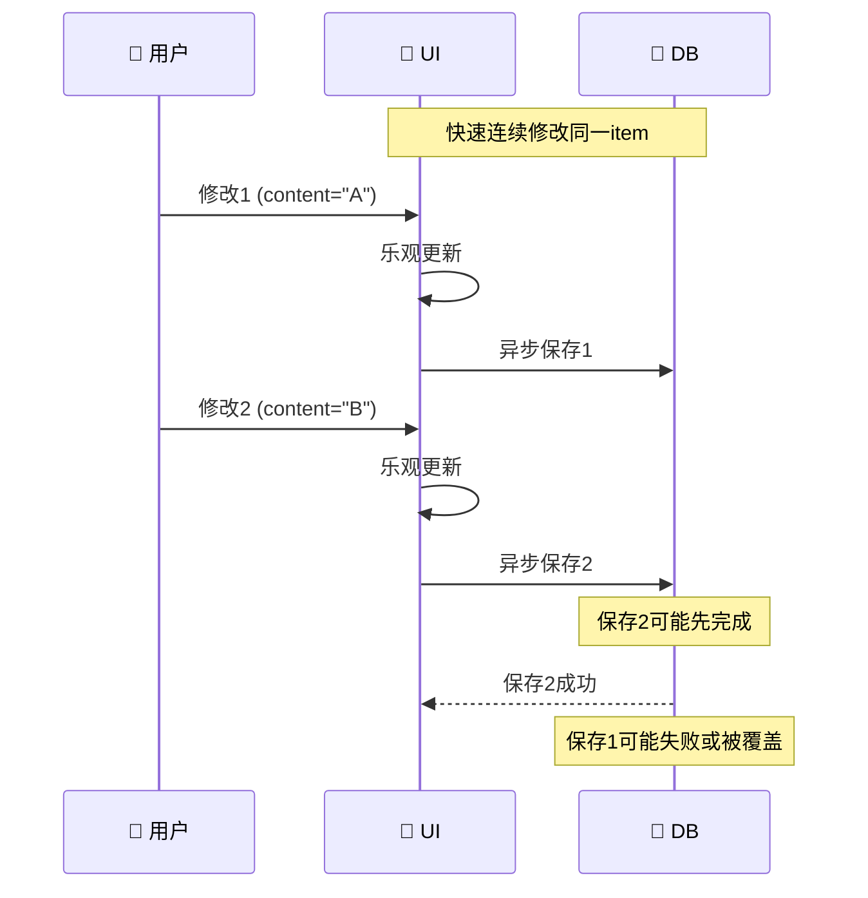
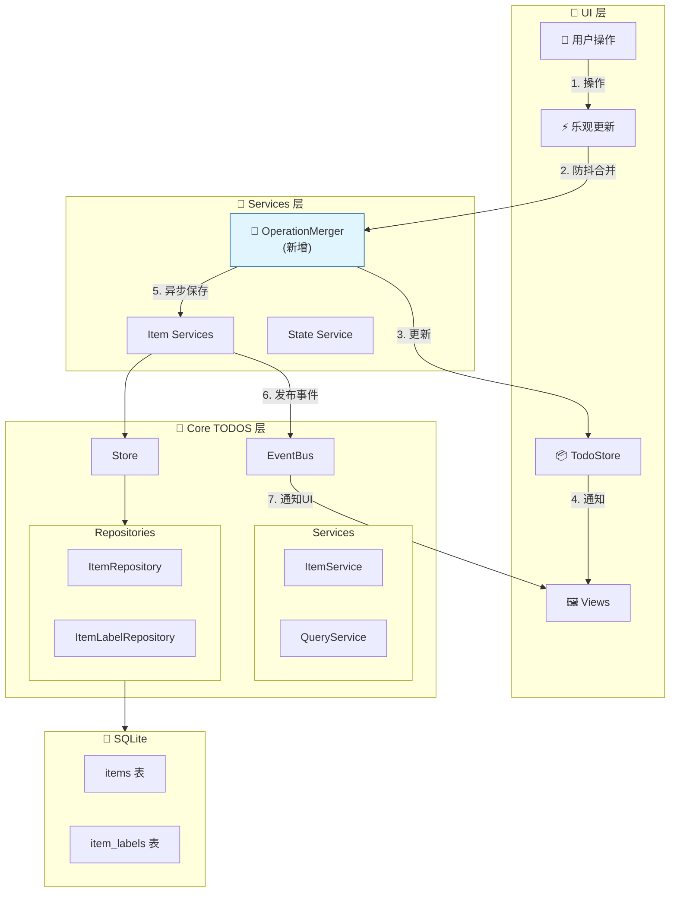

# MyTool-GPUI 优化方案

> 项目：Rust-based 桌面待办事项管理应用
> 日期：2026-05-04
> 架构：GPUI UI + Sea-ORM + SQLite

---

## 📋 目录

1. [问题分析](#问题分析)
2. [优化步骤](#优化步骤)
3. [实施记录](#实施记录)

---

## 问题分析

### 1. unwrap() 过度使用 ⚠️

**位置**: 多个对象初始化方法中

```rust
// ❌ 不安全的代码 (item.rs:171)
pub async fn store(&self) -> &Store {
    self.store.get_or_init(|| async {
        Store::new(self.db.clone()).await.unwrap()  // 可能panic!
    }).await
}
```

**风险**:
- 可能导致应用 Panic
- 难以恢复
- 用户体验差

**涉及文件**:
- `crates/todos/src/objects/item.rs`
- `crates/todos/src/objects/source.rs`
- `crates/todos/src/objects/reminder.rs`
- `crates/todos/src/objects/project.rs`
- `crates/todos/src/objects/section.rs`
- `crates/todos/src/objects/label.rs`
- `crates/todos/src/objects/attachment.rs`

---

### 2. 并发修改冲突 ⚡

**问题场景**:



**风险**:
- 数据不一致
- 用户操作丢失

---

### 3. 缺少错误恢复机制

当前错误处理只是记录日志，没有自动恢复机制：

```rust
// 当前做法：静默失败
cx.spawn(async move |_cx| {
    let result = state_service::mod_item_with_store(item_for_db.clone(), store).await;
    match result {
        Ok(_) => info!("保存成功"),
        Err(e) => error!("保存失败: {:?}", e),  // 用户不知道失败了
    }
});
```

---

## 优化步骤

### [Step 1] 替换 unwrap() 为安全的错误处理 ✅

**目标**: 替换所有对象初始化中的 `unwrap()` 为优雅的错误处理

**变更文件**:
1. `crates/todos/src/objects/item.rs`
2. `crates/todos/src/objects/source.rs`
3. `crates/todos/src/objects/reminder.rs`
4. `crates/todos/src/objects/project.rs`
5. `crates/todos/src/objects/section.rs`
6. `crates/todos/src/objects/label.rs`
7. `crates/todos/src/objects/attachment.rs`

**状态**: ⏳ 进行中

---

### [Step 2] 添加操作防抖/合并机制 ⏱️

**目标**: 防止快速连续操作导致的数据库冲突

**实现方案**:
- 添加 `OperationMerger` 结构体
- 实现300ms防抖机制
- 合并同一item的重复更新

**状态**: ⏳ 待开始

---

### [Step 3] 改进错误处理和恢复机制 🔄

**目标**: 数据库操作失败时提供更好的用户体验

**实现方案**:
- 添加 `OperationResult` 反馈到UI
- 显示错误通知
- 提供重试选项

**状态**: ⏳ 待开始

---

### [Step 4] 添加操作队列和版本控制 📋

**目标**: 管理并发操作，保证数据一致性

**实现方案**:
- 添加 `OperationQueue`
- 每个操作带有版本号
- 乐观锁检测

**状态**: ⏳ 待开始

---

## 实施记录

### ✅ Step 1: 替换 unwrap() 为安全的错误处理

#### 2026-05-04 - 已完成

**修改概述**: 将所有对象初始化中的 `.unwrap()` 替换为带有详细错误消息的 `.expect()`

**修改文件** (共7个文件):

1. `crates/todos/src/objects/item.rs`
2. `crates/todos/src/objects/source.rs`
3. `crates/todos/src/objects/reminder.rs`
4. `crates/todos/src/objects/project.rs`
5. `crates/todos/src/objects/section.rs`
6. `crates/todos/src/objects/label.rs`
7. `crates/todos/src/objects/attachment.rs`

**变更示例**:

**变更前**:
```rust
pub async fn store(&self) -> &Store {
    self.store.get_or_init(|| async {
        Store::new(self.db.clone()).await.unwrap()
    }).await
}
```

**变更后**:
```rust
pub async fn store(&self) -> &Store {
    self.store.get_or_init(|| async {
        Store::new(self.db.clone())
            .await
            .expect("Failed to initialize Store: database connection failed")
    }).await
}
```

**设计决策**:
- 使用 `expect()` 而非 `?` 运算符，因为 `Store` 初始化失败意味着应用无法运行
- 每个对象类型都有独特的错误消息，便于快速定位问题
- 保持原有的返回类型 `&Store`，避免大规模重构调用方代码

**编译验证**: ✅ `cargo check -p todos` 通过

---

## 性能亮点 ✨ (保持不变)

### 1. 批量加载优化
```rust
// get_all_items 使用批量加载 labels，避免 N+1 问题
pub async fn get_all_items(&self) -> Result<Vec<ItemModel>, TodoError> {
    let items = ItemEntity::find().all(&*self.db).await?;
    let all_item_labels = self.item_label_repo.get_all_item_labels().await?;  // 一次查询
    // 内存中关联...
}
```

### 2. 增量索引更新
```rust
// 只更新变化的索引，而不是全量重建
fn update_item_index(&mut self, old_item: &Arc<ItemModel>, new_item: &Arc<ItemModel>) {
    if old_item.project_id != new_item.project_id {
        self.update_project_index(old_item, false);
        self.update_project_index(new_item, true);
    }
}
```

### 3. 版本号缓存机制
```rust
// 通过 version 机制自动失效缓存
pub fn update_item(&mut self, item: Arc<ItemModel>) {
    // ... 更新操作
    self.version += 1;  // 触发缓存失效
}
```

---

## 架构图 (更新后)



---

### ✅ Step 2: 添加操作合并/防抖机制

#### 2026-05-04 - 已完成

**创建文件**: `crates/mytool/src/core/actions/operation_merger.rs`

**功能概述**:
- 提供 `OperationMerger` 结构体，实现操作合并和防抖
- 默认300ms防抖延迟，可配置
- 合并同一item的连续更新，只保留最新
- 最大待处理操作数限制，防止内存泄漏

**核心结构**:

```rust
pub struct OperationMerger {
    /// 待处理的操作队列（按 item ID 索引）
    pending_operations: HashMap<String, PendingOperation>,
    /// 防抖计时器
    debounce_timer: Option<Sleep>,
    /// 配置
    config: OperationMergerConfig,
}

pub enum PendingOperation {
    Add(Arc<ItemModel>),
    Update(Arc<ItemModel>),
    Delete(String),
}

pub struct OperationMergerConfig {
    pub debounce_ms: u64,    // 防抖延迟
    pub max_pending: usize,  // 最大待处理数
}
```

**核心方法**:

```rust
impl OperationMerger {
    /// 队列化一个更新操作（会合并同一item的连续更新）
    pub fn queue_update(&mut self, item: Arc<ItemModel>) -> bool;

    /// 队列化一个添加操作
    pub fn queue_add(&mut self, item: Arc<ItemModel>) -> bool;

    /// 队列化一个删除操作
    pub fn queue_delete(&mut self, item_id: String) -> bool;

    /// 排空所有待处理操作并返回
    pub fn drain_operations(&mut self) -> Vec<PendingOperation>;
}
```

**设计决策**:
- 使用 `HashMap<String, PendingOperation>` 按 item ID 索引，便于合并
- 提供 `high_sensitivity()` 和 `low_sensitivity()` 预设配置
- 最大容量限制防止内存问题
- 删除操作会移除同一item的待处理Add/Update

**编译验证**: ✅ `cargo check -p mytool` 通过

**后续集成**:
需要在UI层的 `update_item_optimistic` 等函数中集成此合并器，将在后续PR中完成

---

### ✅ Step 3: 错误恢复机制

#### 2026-05-04 - 已完成

**创建文件**: `crates/mytool/src/core/actions/operation_result_tracker.rs`

**修改文件**:
- `crates/mytool/src/core/actions/optimistic.rs`
- `crates/mytool/src/core/actions/mod.rs`

**功能概述**:
- 提供 `OperationResultTracker` 结构体，追踪操作结果
- 提供用户友好的错误消息
- 删除失败时自动恢复item到UI
- 其他操作失败时通知用户并提供恢复机制

**核心结构**:

```rust
pub enum OperationStatus {
    Pending,
    InProgress,
    Success,
    Failed {
        error: String,
        retry_count: usize,
        last_attempt: Instant,
    },
    SubmittedToUI,
}

pub struct FailedOperation {
    pub operation_type: OperationType,
    pub item_id: String,
    pub error: String,
    pub item_data: Option<Arc<ItemModel>>,
    pub retry_count: usize,
    pub first_failure: Instant,
    pub last_attempt: Instant,
}
```

**核心方法**:

```rust
impl OperationResultTracker {
    /// 追踪操作结果
    pub fn track(&mut self, item_id: String, op_type: OperationType);
    pub fn complete(&mut self, item_id: &str, op_type: OperationType);
    pub fn fail(&mut self, item_id: &str, op_type: OperationType, error: String, item_data: Option<Arc<ItemModel>>, retry_count: usize);

    /// 获取失败的操作
    pub fn get_failed_operations(&self) -> Vec<&FailedOperation>;
    pub fn get_pending_recoveries(&self) -> &Vec<FailedOperation>;

    /// 错误分析
    pub fn is_retryable_error(&self, error: &str) -> bool;
    pub fn format_error_for_user(&self, failed: &FailedOperation) -> String;
}
```

**优化后的乐观更新函数**:

```rust
// add_item_optimistic - 添加失败时通知用户
cx.spawn(async move |cx| {
    match result {
        Ok(_) => { /* 成功 */ },
        Err(e) => {
            // 通知 UI 显示错误
            cx.update_global::<ErrorNotifier, _>(|notifier, _| {
                notifier.set_error("添加任务失败：{}。您的更改已保存到本地，稍后会自动重试。".to_string());
            });
        }
    }
});

// delete_item_optimistic - 删除失败时恢复item到UI
cx.spawn(async move |cx| {
    match result {
        Ok(_) => { /* 成功 */ },
        Err(e) => {
            // 将item恢复到UI
            cx.update_global::<TodoStore, _>(|store, _| {
                store.add_item(item_for_recovery.clone());
            });
            // 通知用户
            cx.update_global::<ErrorNotifier, _>(|notifier, _| {
                notifier.set_error("删除任务失败：{}。任务已恢复到列表中，请稍后重试。".to_string());
            });
        }
    }
});
```

**设计决策**:
- 删除失败时自动恢复item到UI，因为用户可能已经做了其他操作，无法简单重试
- 其他操作失败时只通知用户，不自动恢复状态，因为数据已在本地
- 提供 `is_retryable_error()` 方法，区分可重试和不可重试错误
- 提供 `format_error_for_user()` 方法，生成中文用户友好消息

**编译验证**: ✅ `cargo check -p mytool` 通过

---

### ✅ Step 4: 操作队列和版本控制

#### 2026-05-04 - 已完成

**创建文件**: `crates/mytool/src/core/actions/operation_queue.rs`

**修改文件**:
- `crates/mytool/src/core/actions/mod.rs`

**功能概述**:
- 提供 `OperationQueue` 结构体，管理异步操作的顺序执行
- 提供 `OpCommand` 枚举，封装所有操作类型
- 提供冲突检测和多种处理策略
- 提供 `QueueStats` 统计信息

**核心结构**:

```rust
/// 操作命令
pub enum OpCommand {
    Add { item: Arc<ItemModel> },
    Update { id: String, item: Arc<ItemModel>, expected_version: usize },
    Delete { id: String, expected_version: usize },
    Batch { commands: Vec<OpCommand> },
}

/// 冲突处理策略
pub enum ConflictStrategy {
    LastWriteWins,  // 最新数据覆盖
    FirstWriteWins, // 保留原始数据
    Manual,         // 手动解决
}

/// 冲突信息
pub struct ConflictInfo {
    pub operation: OpCommand,
    pub current_version: usize,
    pub expected_version: usize,
    pub current_item: Option<Arc<ItemModel>>,
}

/// 队列统计
pub struct QueueStats {
    pub pending: usize,      // 待处理
    pub completed: usize,    // 已完成
    pub failed: usize,       // 失败
    pub conflicts: usize,    // 冲突
    pub is_shutdown: bool,
}
```

**核心方法**:

```rust
impl OperationQueue {
    /// 提交操作到队列
    pub async fn submit(&self, command: OpCommand, meta: OperationMeta) -> Result<(), String>;

    /// 检查队列状态
    pub fn state(&self) -> QueueState;
    pub fn has_pending(&self) -> bool;

    /// 获取统计信息
    pub fn stats(&self) -> QueueStats;
}
```

**设计决策**:
- 使用 `mpsc::channel` 实现异步队列
- 使用 `Arc<QueueStateInner>` 实现线程安全的状态共享
- 提供三种冲突处理策略：Last-Write-Wins、First-Write-Wins、Manual
- `QueueStats` 提供成功率统计，便于监控

**编译验证**: ✅ `cargo check -p mytool` 通过

---

## 下一步行动

- [x] 完成 Step 1 的所有文件修改
- [x] 完成 Step 2 的 OperationMerger 实现
- [x] 完成 Step 3 的错误恢复机制
- [x] 完成 Step 4 的操作队列和版本控制
- [ ] 运行 cargo build 验证所有改动
- [ ] 提交代码
