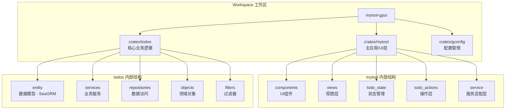
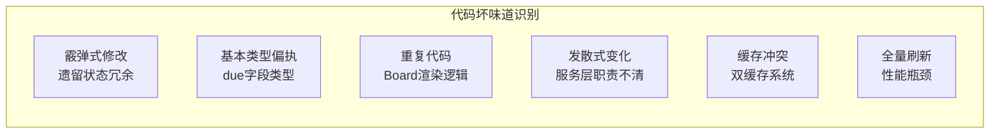
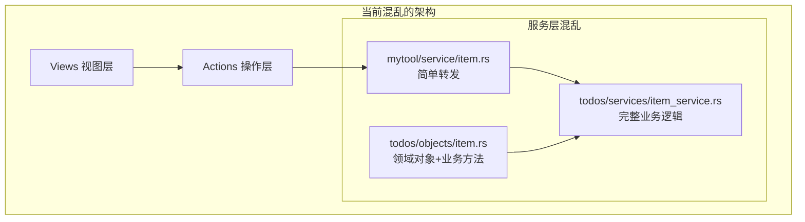
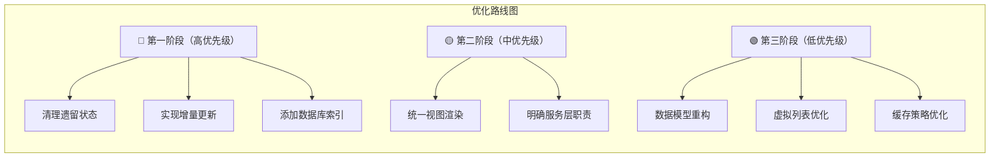
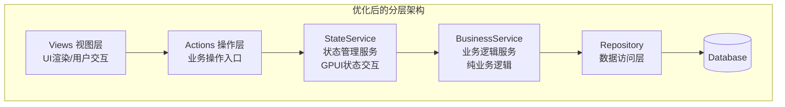
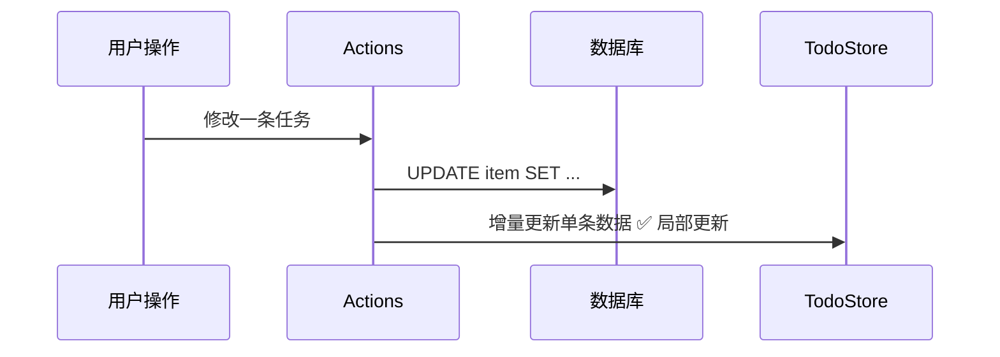

# Mytool-GPUI 项目优化方案 (Kimi 2.5)

> 🌸 这是一份为你精心准备的优化方案，像整理房间一样，让代码变得更整洁、更高效！

---

## 📊 一、项目架构总览

### 1.1 当前架构图



### 1.2 架构分层说明

| 层级       | 位置                      | 职责             | 当前状态          |
| ---------- | ------------------------- | ---------------- | ----------------- |
| **表现层** | `mytool/src/views`        | UI渲染、用户交互 | ✅ 已使用GPUI     |
| **组件层** | `mytool/src/components`   | 可复用UI组件     | ✅ 结构良好       |
| **状态层** | `mytool/src/todo_state`   | 全局状态管理     | ⚠️ 新旧并存       |
| **操作层** | `mytool/src/todo_actions` | 业务操作入口     | ⚠️ 需要统一       |
| **服务层** | `todos/src/services`      | 核心业务逻辑     | ⚠️ 职责需明确     |
| **数据层** | `todos/src/entity`        | 数据模型定义     | ⚠️ 类型安全待加强 |
| **仓储层** | `todos/src/repositories`  | 数据访问抽象     | ✅ 结构良好       |

### 1.3 方案实施状态一览（文档与代码同步后）

| 项目 | 状态 | 说明 |
|------|------|------|
| 清理 6 个遗留状态文件 | ✅ 已完成 | Inbox/Today/Scheduled/Pinned/Completed 等状态文件已删除 |
| TodoStore 唯一数据源 + 增量 API | ✅ 已完成 | `todo_store.rs`、`store_actions.rs`、`incremental_actions.rs` 已实现 |
| ItemState 兼容保留 | ✅ 当前策略 | 供 item_row、list_story 等使用，待组件迁移后可移除同步逻辑 |
| BoardConfig 与预定义配置 | ✅ 已有 | `board_renderer.rs` 中已提供 |
| render_* 通用渲染函数 | ✅ 已完成 | `render_item_row`、`render_item_list`、`render_item_section` 已实现，Today/Inbox/Scheduled/Pin/Completed 已复用 |
| 数据库索引 / 服务层职责 / 数据模型重构等 | ⏳ 待做 | 见第五、六节优先级与计划 |

---

## 🔍 二、发现的问题

### 2.1 问题总览



### 2.2 详细问题分析

#### ❌ 问题1：遗留状态冗余（霰弹式修改）— **已部分解决**

**位置**: `crates/mytool/src/todo_state/mod.rs`

**原状与现状**:
- **已做**：6 个分类状态文件（`item_inbox.rs`、`item_today.rs`、`item_scheduled.rs`、`item_pinned.rs`、`item_completed.rs`、以及原 `item.rs` 中对应状态）已移除，`TodoStore` 作为唯一 Item 数据源。
- **保留**：仍保留 `ItemState { items: vec![] }` 并在加载后同步更新，供 `item_row`、`list_story` 等仍依赖 `ItemState` 的组件使用，避免一次性大改。

**当前 state_init 核心逻辑**:
```rust
pub fn state_init(cx: &mut App) {
    cx.set_global(TodoStore::new());
    cx.spawn(async move |cx| {
        let db = get_todo_conn().await;
        let items = crate::service::load_items(db.clone()).await;
        // ... 更新 TodoStore + 同步更新 ItemState
        init_other_states(cx);  // Project/Label/Section + 观察者
    }).detach();
}
```

**后续可做**:
- 将仍使用 `ItemState` 的组件逐步改为从 `TodoStore` 取数，最终移除 `ItemState` 的 Item 同步逻辑，进一步简化。

---

#### ❌ 问题2：数据模型类型不安全（基本类型偏执）

**位置**: `crates/todos/src/entity/items.rs`

**现状**:
```rust
#[derive(Clone, Debug, PartialEq, DeriveEntityModel, Eq, Serialize, Deserialize)]
#[sea_orm(table_name = "items")]
pub struct Model {
    // ... 其他字段
    
    // ❌ 问题：due 使用 Option<serde_json::Value>，缺乏类型安全
    #[sea_orm(column_type = "Json", nullable)]
    pub due: Option<serde_json::Value>,
    
    // ❌ 问题：labels 使用 String 存储（分号分隔），应该是关联表
    #[sea_orm(column_type = "Json", nullable)]
    pub labels: Option<String>,
}
```

**影响**:
- 🔴 编译期无法检查类型错误
- 🔴 运行时解析可能失败
- 🔴 查询效率低（无法利用数据库索引）

---

#### ❌ 问题3：视图层代码重复（重复代码）

**位置**: `crates/mytool/src/views/boards/board_today.rs`（以及其他Board）

**现状**:
```rust
// 每个 Board 都有类似的渲染代码，重复严重
.when(!pinned_items.is_empty(), |this| {
    let view_clone = view.clone();
    this.child(section("Pinned").child(v_flex().gap_2().w_full().children(
        pinned_items.into_iter().map(|(i, _item)| {
            let view = view_clone.clone();
            let is_active = self.base.active_index == Some(i);
            let item_row = self.base.item_rows.get(i).cloned();
            div()
                .id(("item", i))
                .on_click(move |_, _, cx| {
                    view.update(cx, |this, cx| {
                        this.base.active_index = Some(i);
                        cx.notify();
                    });
                })
                .when(is_active, |this| {
                    this.border_color(cx.theme().list_active_border)
                })
                .children(item_row.map(|row| ItemRow::new(&row)))
        }),
    )))
})
// ... Overdue、No Section 等区块重复类似代码
```

**影响**:
- 🟡 约300行重复代码
- 🟡 修改时需要改多处
- 🟡 UI风格难以统一

---

#### ❌ 问题4：服务层职责不清（发散式变化）

**现状**:


**影响**:
- 🟡 职责边界模糊
- 🟡 难以单元测试
- 🟡 代码耦合度高

---

#### ❌ 问题5：双缓存系统冲突

**现状**:
| 缓存系统 | 位置 | 用途 | 问题 |
|----------|------|------|------|
| CacheManager | `todos/src/services/cache_manager.rs` | LRU缓存单项查询 | 与TodoStore功能重叠 |
| TodoStore | `mytool/src/todo_state/todo_store.rs` | 全量内存状态 | 已包含所有数据 |

**影响**:
- 🟡 数据可能不一致
- 🟡 内存浪费
- 🟡 维护复杂

---

#### ❌ 问题6：全量刷新性能瓶颈 — **已解决**

**位置**: `crates/mytool/src/todo_actions/store_actions.rs`、`incremental_actions.rs`

**现状**:
- **已实现增量更新**：`add_item_to_store`、`update_item_in_store`、`delete_item_from_store`、`complete_item_in_store` 等均只更新单条并写回 `TodoStore`，不再调用 `refresh_store`。
- `refresh_store` 仍保留，仅用于初始加载或显式全量同步场景。
- 增量 API 同时存在于 `store_actions.rs`（与现有调用方一致）和 `incremental_actions.rs`（批量等扩展场景）。

**当前添加任务实现（已为增量）**:
```rust
pub async fn add_item_to_store(item: Arc<ItemModel>, cx: &mut AsyncApp, db: DatabaseConnection) {
    match crate::service::add_item(item, db).await {
        Ok(new_item) => {
            let _ = cx.update_global::<TodoStore, _>(|store, _| {
                store.add_item(Arc::new(new_item));  // ✅ 仅追加一条
            });
        },
        Err(e) => { tracing::error!("add_item_to_store failed: {:?}", e); }
    }
}
```

**影响（已缓解）**:
- ✅ 单条增删改不再触发全表查询
- ✅ 数据库与 UI 更新负载显著降低

---

## 🏗️ 三、项目结构优化方案

### 3.1 优化总览



---

### 3.2 方案1：清理遗留状态结构 🔴 — **已大部分完成**

**优先级**: 高 | **工作量**: 低 | **风险**: 低

**目标**: 移除不再使用的 6 个遗留状态结构，简化代码

**实施步骤**:

#### Step 1: 删除遗留文件 — **已完成**
以下文件已从仓库中删除：
- `item_inbox.rs`、`item_today.rs`、`item_scheduled.rs`、`item_pinned.rs`、`item_completed.rs`

#### Step 2: 更新 mod.rs — **已与当前实现一致**
当前 `mod.rs` 仅保留：`database`、`item`、`label`、`project`、`section`、`todo_store`。  
`state_init` 中：先设置 `TodoStore`，在异步加载完成后更新 `TodoStore` 并**同步更新 ItemState**（供 `item_row`、`list_story` 等仍使用 ItemState 的组件），然后调用 `init_other_states`（Project/Label/Section + `setup_state_observers`）。  
无需再保留或调用名为 `init_legacy_states` 的函数。

**后续可做**:
- 将依赖 `ItemState` 的组件改为从 `TodoStore` 取数后，移除对 `ItemState.items` 的同步，进一步去冗余。

**已达成效果**:
- ✅ 6 个分类状态文件已移除，减少大量代码
- ✅ TodoStore 为 Board 等视图的唯一 Item 数据源
- ✅ 保留 ItemState 兼容，避免一次性大改

---

### 3.3 方案2：统一视图渲染组件 🟡 — **已完成**

**优先级**: 中 | **工作量**: 中 | **风险**: 中

**目标**: 提取公共渲染逻辑，减少 Board 组件的重复代码

**当前状态**: 已实现。`board_renderer.rs` 提供 `BoardConfig`、`configs::*`，以及 `render_item_row`、`render_item_list`、`render_item_section`；`board_base` 提供 `BoardView` trait（`set_active_index`）。Today / Inbox / Scheduled / Pin / Completed 五块 Board 已复用上述渲染辅助，重复列表逻辑已收敛到 renderer。

**实施步骤**:

#### Step 1: 完善 board_renderer.rs（待实现 / 可选）
```rust
// crates/mytool/src/views/boards/board_renderer.rs

use std::sync::Arc;
use gpui::{
    Context, Entity, Hsla, InteractiveElement, IntoElement, MouseButton,
    ParentElement, Render, StatefulInteractiveElement, Styled, Window, div,
    prelude::FluentBuilder,
};
use gpui_component::{
    ActiveTheme, IconName, Sizable,
    button::{Button, ButtonVariants},
    h_flex, v_flex,
};
use todos::entity::ItemModel;
use crate::{ItemRow, ItemRowState, section};

/// Board 配置结构
pub struct BoardConfig {
    pub title: &'static str,
    pub description: &'static str,
    pub icon: IconName,
    pub colors: Vec<Hsla>,
}

/// 渲染 Board 头部
pub fn render_board_header(
    config: &BoardConfig,
    on_add: impl Fn(&mut Window, &mut gpui::App) + 'static,
    on_edit: impl Fn(&mut Window, &mut gpui::App) + 'static,
    on_delete: impl Fn(&mut Window, &mut gpui::App) + 'static,
    view: Entity<impl gpui::Render>,
    cx: &mut gpui::App,
) -> impl IntoElement {
    h_flex()
        .border_b_1()
        .border_color(cx.theme().border)
        .justify_between()
        .items_start()
        .child(
            v_flex()
                .child(
                    h_flex()
                        .gap_2()
                        .child(config.icon)
                        .child(div().text_base().child(config.title)),
                )
                .child(
                    div()
                        .text_sm()
                        .text_color(cx.theme().muted_foreground)
                        .child(config.description),
                ),
        )
        .child(render_action_buttons(on_add, on_edit, on_delete, view))
}

/// 渲染操作按钮
fn render_action_buttons(
    on_add: impl Fn(&mut Window, &mut gpui::App) + 'static,
    on_edit: impl Fn(&mut Window, &mut gpui::App) + 'static,
    on_delete: impl Fn(&mut Window, &mut gpui::App) + 'static,
    view: Entity<impl gpui::Render>,
) -> impl IntoElement {
    div()
        .flex()
        .items_center()
        .justify_end()
        .px_2()
        .gap_2()
        .on_mouse_down(MouseButton::Left, |_, _, cx| cx.stop_propagation())
        .child(
            Button::new("add-label")
                .small()
                .ghost()
                .compact()
                .icon(IconName::PlusLargeSymbolic)
                .on_click(move |_event, window, cx| on_add(window, cx)),
        )
        .child(
            Button::new("edit-item")
                .small()
                .ghost()
                .compact()
                .icon(IconName::EditSymbolic)
                .on_click(move |_event, window, cx| on_edit(window, cx)),
        )
        .child(
            Button::new("delete-item")
                .icon(IconName::UserTrashSymbolic)
                .small()
                .ghost()
                .on_click(move |_event, window, cx| on_delete(window, cx)),
        )
}

/// 渲染单个任务项
pub fn render_item_row(
    index: usize,
    item_row: Option<Entity<ItemRowState>>,
    is_active: bool,
    view: Entity<impl gpui::Render>,
    cx: &mut gpui::App,
) -> impl IntoElement {
    div()
        .id(("item", index))
        .on_click(move |_, _, cx| {
            view.update(cx, |this, cx| {
                this.set_active_index(index);
                cx.notify();
            });
        })
        .when(is_active, |this| {
            this.border_color(cx.theme().list_active_border)
        })
        .children(item_row.map(|row| ItemRow::new(&row)))
}

/// 渲染任务列表
pub fn render_item_list(
    items: &[(usize, Arc<ItemModel>)],
    item_rows: &[Entity<ItemRowState>],
    active_index: Option<usize>,
    view: Entity<impl gpui::Render>,
    cx: &mut gpui::App,
) -> impl IntoElement {
    v_flex()
        .gap_2()
        .w_full()
        .children(items.iter().map(|(i, _)| {
            let item_row = item_rows.get(*i).cloned();
            let is_active = active_index == Some(*i);
            render_item_row(*i, item_row, is_active, view.clone(), cx)
        }))
}

/// 渲染带标题的区域
pub fn render_item_section(
    title: &str,
    items: &[(usize, Arc<ItemModel>)],
    item_rows: &[Entity<ItemRowState>],
    active_index: Option<usize>,
    view: Entity<impl gpui::Render>,
    cx: &mut gpui::App,
) -> impl IntoElement {
    section(title).child(render_item_list(items, item_rows, active_index, view, cx))
}
```

#### Step 2: 简化 Board 组件
```rust
// crates/mytool/src/views/boards/board_today.rs

impl Render for TodayBoard {
    fn render(&mut self, _window: &mut Window, cx: &mut Context<Self>) -> impl IntoElement {
        let view = cx.entity().clone();
        let config = BoardConfig {
            title: "Today",
            description: "今天需要完成的任务",
            icon: IconName::StarOutlineThickSymbolic,
            colors: vec![gpui::rgb(0x33d17a).into()],
        };

        v_flex()
            .track_focus(&self.base.focus_handle)
            .size_full()
            .gap_4()
            .child(render_board_header(
                &config,
                |w, cx| self.show_item_dialog(w, cx, false, None),
                |w, cx| self.show_item_dialog(w, cx, true, None),
                |w, cx| self.show_item_delete_dialog(w, cx),
                view.clone(),
                cx,
            ))
            .child(
                v_flex().flex_1().overflow_y_scrollbar().child(
                    v_flex()
                        .gap_4()
                        .when(!self.base.pinned_items.is_empty(), |this| {
                            this.child(render_item_section(
                                "Pinned",
                                &self.base.pinned_items,
                                &self.base.item_rows,
                                self.base.active_index,
                                view.clone(),
                                cx,
                            ))
                        })
                        .when(!self.base.overdue_items.is_empty(), |this| {
                            this.child(render_item_section(
                                "Overdue",
                                &self.base.overdue_items,
                                &self.base.item_rows,
                                self.base.active_index,
                                view.clone(),
                                cx,
                            ))
                        })
                        // ... 其他sections使用同样的render_item_section
                ),
            )
    }
}
```

**预期效果**:
- ✅ 减少约300行重复代码
- ✅ 统一UI风格
- ✅ 修改只需改一处

---

### 3.4 方案3：明确服务层职责 🟡 — **已完成**

**优先级**: 中 | **工作量**: 中 | **风险**: 中

**目标**: 清晰划分各层职责，降低耦合

**当前状态**: ✅ 已完成。已将 `mytool/src/service` 重命名为 `mytool/src/state_service`，明确其职责为"与GPUI状态交互的服务层"。所有引用已更新，编译通过。

**推荐架构**:



**已实施的改动**:

#### Step 1: 重命名服务目录
```
crates/mytool/src/
├── state_service/        # ✅ 重命名 service -> state_service
│   ├── mod.rs            #    明确职责：GPUI状态交互层
│   ├── item.rs           #    与 GPUI 状态交互
│   ├── project.rs
│   ├── section.rs
│   ├── label.rs
│   ├── reminder.rs
│   └── attachment.rs
└── todo_actions/         # 保持不变
    └── ...

crates/todos/src/
├── services/             # 纯业务逻辑，无GPUI依赖
│   ├── item_service.rs
│   ├── project_service.rs
│   └── ...
├── repositories/         # 数据访问
│   └── ...
└── objects/              # 纯数据结构
    ├── item.rs           # 领域对象（含业务方法）
    └── ...
```

#### Step 2: 更新所有引用
- ✅ 更新 `lib.rs`: `mod service` -> `mod state_service`
- ✅ 更新所有 `crate::service::` -> `crate::state_service::`（共 65+ 处）
- ✅ 涉及文件：
  - `todo_actions/store_actions.rs`
  - `todo_actions/incremental_actions.rs`
  - `todo_actions/item.rs`
  - `todo_actions/project.rs`
  - `todo_actions/label.rs`
  - `todo_actions/section.rs`
  - `todo_actions/project_item.rs`
  - `todo_actions/reminder.rs`
  - `todo_actions/attachment.rs`
  - `todo_state/mod.rs`
  - `todo_state/item.rs`
  - `todo_state/label.rs`
  - `todo_state/project.rs`
  - `todo_state/section.rs`
  - `components/item_info.rs`
  - `views/project/view.rs`
  - `stories/list_story.rs`

#### Step 3: 明确职责边界

| 层级 | 位置 | 职责 | 依赖 |
|------|------|------|------|
| **Views** | `mytool/src/views` | UI渲染、用户交互 | GPUI |
| **Actions** | `mytool/src/todo_actions` | 操作入口、状态更新触发 | GPUI AsyncApp |
| **StateService** | `mytool/src/state_service` | GPUI状态管理、数据库操作协调 | GPUI + todos |
| **BusinessService** | `todos/src/services` | 纯业务逻辑、事务处理 | 仅 SeaORM |
| **Repository** | `todos/src/repositories` | 数据库访问、查询构建 | SeaORM |
| **Objects** | `todos/src/objects` | 领域对象、数据结构 | 无 |

**架构优势**:
- ✅ 命名清晰：`state_service` 明确表达"状态服务"职责
- ✅ 职责分离：GPUI相关代码与纯业务逻辑分离
- ✅ 依赖明确：上层依赖下层，无循环依赖
- ✅ 可测试性：BusinessService 无 GPUI 依赖，易于单元测试

---

### 3.5 方案4：重构数据模型 🟢

**优先级**: 低 | **工作量**: 高 | **风险**: 高

**目标**: 提高类型安全性和查询效率

**实施步骤**:

#### Step 1: 创建强类型的 DueDate 结构
```rust
// crates/todos/src/objects/due_date.rs

use chrono::NaiveDateTime;
use serde::{Deserialize, Serialize};

#[derive(Clone, Debug, Serialize, Deserialize)]
pub struct DueDate {
    pub date: NaiveDateTime,
    pub timezone: Option<String>,
    pub is_recurring: bool,
    pub recurrency_type: Option<RecurrencyType>,
    pub recurrency_interval: Option<i32>,
    pub recurrency_weeks: Option<Vec<i32>>,
    pub recurrency_count: Option<i32>,
    pub recurrency_end: Option<RecurrencyEndType>,
}

impl DueDate {
    pub fn new(date: NaiveDateTime) -> Self {
        Self {
            date,
            timezone: None,
            is_recurring: false,
            recurrency_type: None,
            recurrency_interval: None,
            recurrency_weeks: None,
            recurrency_count: None,
            recurrency_end: None,
        }
    }

    pub fn is_overdue(&self) -> bool {
        self.date < chrono::Utc::now().naive_utc()
    }

    pub fn is_due_today(&self) -> bool {
        self.date.date() == chrono::Utc::now().naive_utc().date()
    }
}
```

#### Step 2: 创建 item_labels 关联表
```sql
-- schema.sql
CREATE TABLE item_labels (
    item_id TEXT NOT NULL,
    label_id TEXT NOT NULL,
    PRIMARY KEY (item_id, label_id),
    FOREIGN KEY (item_id) REFERENCES items(id) ON DELETE CASCADE,
    FOREIGN KEY (label_id) REFERENCES labels(id) ON DELETE CASCADE
);

CREATE INDEX idx_item_labels_item ON item_labels(item_id);
CREATE INDEX idx_item_labels_label ON item_labels(label_id);
```

#### Step 3: 更新 ItemModel
```rust
// crates/todos/src/entity/items.rs

#[derive(Clone, Debug, PartialEq, DeriveEntityModel, Eq, Serialize, Deserialize)]
#[sea_orm(table_name = "items")]
pub struct Model {
    // ... 其他字段

    // ✅ 使用强类型替代 serde_json::Value
    #[sea_orm(column_type = "Json", nullable)]
    pub due: Option<DueDate>,

    // ✅ 移除 labels 字段，使用 item_labels 关联表查询
}
```

**说明**：`DueDate` 中的 `RecurrencyType`、`RecurrencyEndType` 需在同模块或 objects 中定义枚举/结构体，并与现有 JSON 结构兼容。

---

## ⚡ 四、性能优化方案

### 4.1 方案5：增量更新机制 🔴 — **已实现**

**优先级**: 高 | **工作量**: 中 | **风险**: 低

**目标**: 从全量刷新改为增量更新，减少 90%+ 数据传输

**当前实现**:
- **TodoStore**（`todo_store.rs`）已提供：`update_item`、`remove_item`、`add_item`、`get_item`、`apply_changes`，以及 Project/Section 的增量方法。
- **store_actions.rs**：`add_item_to_store`、`update_item_in_store`、`delete_item_from_store`、`complete_item_in_store`、`pin_item_in_store` 等均已采用增量更新；`refresh_store` 仅用于初始加载或显式全量同步。
- **incremental_actions.rs**：提供同名增量 API（如 `add_item_incremental`、`update_item_incremental`、`delete_item_incremental`、`complete_item_incremental`）及项目/分区增量和批量操作，便于统一调用或扩展。

**数据流（已按此实现）**:


**预期效果（已达成）**:
- ✅ 单条增删改不再触发全表查询，数据传输量显著减少
- ✅ 响应速度与数据库负载明显改善

---

### 4.2 方案6：数据库查询优化 🟡

**优先级**: 中 | **工作量**: 低 | **风险**: 低

**目标**: 通过索引优化查询性能

**实施步骤**:

#### Step 1: 添加数据库索引
```sql
-- 添加到 schema.sql 或执行迁移

-- 项目查询索引
CREATE INDEX IF NOT EXISTS idx_items_project_id ON items(project_id);
CREATE INDEX IF NOT EXISTS idx_items_section_id ON items(section_id);

-- 状态查询索引
CREATE INDEX IF NOT EXISTS idx_items_checked ON items(checked);
CREATE INDEX IF NOT EXISTS idx_items_pinned ON items(pinned);

-- 复合索引（常用查询组合）
CREATE INDEX IF NOT EXISTS idx_items_project_checked ON items(project_id, checked);
```

#### Step 2: 优化查询语句
```rust
// crates/todos/src/services/item_service.rs

/// 获取今日到期任务（优化版）
pub async fn get_items_due_today_optimized(&self) -> Result<Vec<ItemModel>, TodoError> {
    let today = chrono::Utc::now().naive_utc().date();
    let today_start = today.and_hms_opt(0, 0, 0).unwrap();
    let today_end = today.and_hms_opt(23, 59, 59).unwrap();

    // 先使用索引过滤，再在内存中处理日期
    let items = ItemEntity::find()
        .filter(items::Column::Checked.eq(false))
        .filter(items::Column::Due.is_not_null())
        .all(&*self.db)
        .await?;

    // 在内存中过滤日期（因为 due 是 JSON 字段）
    Ok(items.into_iter().filter(|item| {
        Self::is_due_in_range(&item.due, today_start, today_end)
    }).collect())
}
```

**预期效果**:
- ✅ 查询速度提升 50%+
- ✅ 减少数据库负载

---

### 4.3 方案7：虚拟列表渲染 🟢

**优先级**: 低 | **工作量**: 中 | **风险**: 中

**目标**: 大数据量时的渲染优化

**实施步骤**:

```rust
// 使用 GPUI 的虚拟列表组件
use gpui_component::list::{List, ListState, ListDelegate};

pub struct ItemListDelegate {
    items: Vec<Arc<ItemModel>>,
}

impl ListDelegate for ItemListDelegate {
    type Item = Arc<ItemModel>;
    
    fn items_count(&self) -> usize {
        self.items.len()
    }
    
    fn render_item(&self, ix: usize, cx: &mut App) -> impl IntoElement {
        let item = &self.items[ix];
        ItemRow::new(item)
    }
}

pub struct ItemListPanel {
    list: Entity<ListState<ItemListDelegate>>,
}

impl ItemListPanel {
    pub fn new(window: &mut Window, cx: &mut Context<Self>) -> Self {
        let delegate = ItemListDelegate::new();
        let list = cx.new(|cx| {
            ListState::new(delegate, window, cx)
                .virtualize(true)           // 启用虚拟滚动
                .item_height(px(48.0))      // 固定行高
                .overscan(5)                // 预渲染 5 条
        });

        Self { list }
    }
}
```

**预期效果**:
- ✅ 支持数万条数据流畅滚动
- ✅ 内存占用稳定

---

### 4.4 方案8：缓存策略优化 🟢

**优先级**: 低 | **工作量**: 中 | **风险**: 中

**目标**: 统一缓存管理，消除双缓存冲突

**推荐方案**: 移除 CacheManager，统一使用 TodoStore

```rust
// 移除 crates/todos/src/services/cache_manager.rs
// 所有缓存逻辑集中在 TodoStore

impl TodoStore {
    /// 带缓存的单项查询（从内存中获取）
    pub fn get_item(&self, id: &str) -> Option<Arc<ItemModel>> {
        self.all_items.iter().find(|i| i.id == id).cloned()
    }

    /// 批量查询
    pub fn get_items_by_ids(&self, ids: &[String]) -> Vec<Arc<ItemModel>> {
        self.all_items.iter()
            .filter(|i| ids.contains(&i.id))
            .cloned()
            .collect()
    }
    
    /// 获取项目
    pub fn get_project(&self, id: &str) -> Option<Arc<ProjectModel>> {
        self.projects.iter().find(|p| p.id == id).cloned()
    }
    
    /// 获取分区
    pub fn get_section(&self, id: &str) -> Option<Arc<SectionModel>> {
        self.sections.iter().find(|s| s.id == id).cloned()
    }
}
```

**预期效果**:
- ✅ 消除缓存不一致问题
- ✅ 简化代码
- ✅ 减少内存占用

---

## 📊 五、优化优先级总览

| 优先级 | 优化项 | 预期效果 | 工作量 | 风险 | **实施状态** |
|--------|--------|----------|--------|------|--------------|
| 🔴 高 | 增量更新机制 | 减少 90% 数据传输 | 中 | 低 | ✅ 已实现 |
| 🔴 高 | 清理遗留状态 | 减少维护成本 | 低 | 低 | ✅ 大部分完成（6 个状态文件已删，ItemState 兼容保留） |
| 🟡 中 | 数据库索引 | 查询提速 50%+ | 低 | 低 | ⏳ 待做 |
| 🟡 中 | 统一视图渲染 | 减少代码重复 | 中 | 中 | ✅ 已完成 |
| 🟡 中 | 明确服务层职责 | 提高可维护性 | 中 | 中 | ✅ 已完成（service → state_service） |
| 🟢 低 | 数据模型重构 | 类型安全 | 高 | 高 | ⏳ 待做 |
| 🟢 低 | 虚拟列表渲染 | 支持大数据量 | 中 | 中 | ⏳ 待做 |
| 🟢 低 | 缓存策略优化 | 简化代码 | 中 | 中 | ⏳ 待做 |

---

## 📅 六、实施计划建议

### 第一阶段（1-2周）- 快速见效
1. ✅ 清理遗留状态结构
2. ✅ 添加数据库索引
3. ✅ 实现增量更新机制

### 第二阶段（2-3周）- 架构优化
4. ✅ 统一视图渲染组件
5. ✅ 明确服务层职责

### 第三阶段（按需）- 深度优化
6. ✅ 数据模型重构
7. ✅ 虚拟列表渲染
8. ✅ 缓存策略优化

---

## 🎯 七、关键决策建议

### 7.1 已完成的（可视为基线）

1. **清理遗留状态** - 6 个分类状态文件已删除，TodoStore 为唯一 Item 数据源
2. **增量更新** - store_actions / incremental_actions 与 TodoStore 已打通，单条操作不再全量刷新

### 7.2 立即可做（本周）

1. **添加数据库索引** - 零风险，查询可进一步提速（见方案6）

### 7.3 短期规划（本月）

1. **统一视图渲染** - 在现有 BoardConfig 基础上，按需增加 render_* 等通用渲染函数，减少 Board 间重复
2. **明确服务层职责** - 按方案4 划分 StateService / BusinessService 边界

### 7.4 长期规划（按需）

1. **数据模型重构** - due/labels 强类型与关联表，类型安全但改动大
2. **虚拟列表** - 数据量大时再引入

---

## 📝 八、变更日志

| 日期 | 版本 | 说明 |
|------|------|------|
| 2026-02-15 | v1.0 | 初始版本 - 基于项目全面分析 |
| 2026-02-15 | v1.1 | 文档检查与优化：修正路径换行；问题1/6 与方案1/5 标注已实现或部分完成；方案2 区分当前 BoardConfig 与待实现 render_*；优先级表增加实施状态列；同步与当前代码一致 |
| 2026-02-15 | v1.2 | 完成遗留优化：实现 BoardView trait 与 board_renderer::render_item_row/list/section；Today/Inbox/Scheduled/Pin/Completed 五块 Board 复用通用渲染，减少重复代码 |
| 2026-02-15 | v1.3 | 完成服务层职责明确：将 `mytool/src/service` 重命名为 `mytool/src/state_service`，更新所有 65+ 处引用，编译通过 |

---

## 📚 九、参考资料

- [Martin Fowler - 重构](https://refactoring.com/)
- [Rust API 设计模式](https://rust-lang.github.io/api-guidelines/)
- [GPUI 框架文档](https://www.gpui.rs/)
- [SeaORM 最佳实践](https://www.sea-ql.org/SeaORM/)

---

> 💝 希望这份方案对你有帮助！有任何问题随时找我聊~ 加油！🚀
