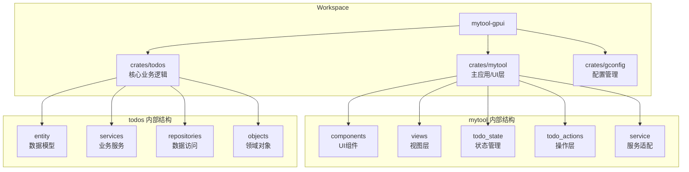
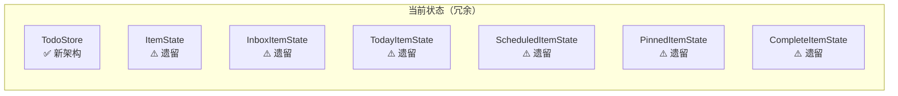
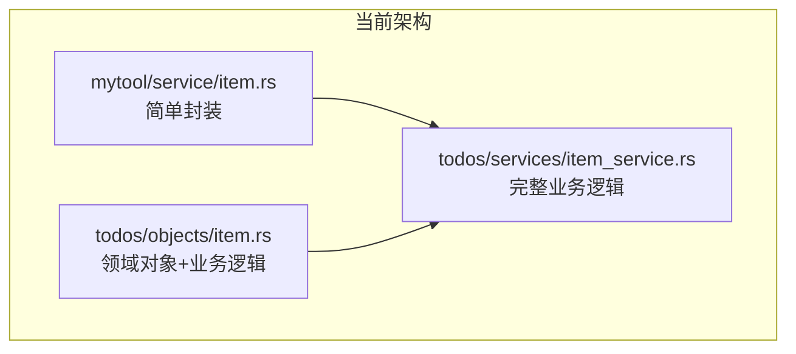
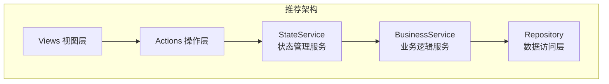
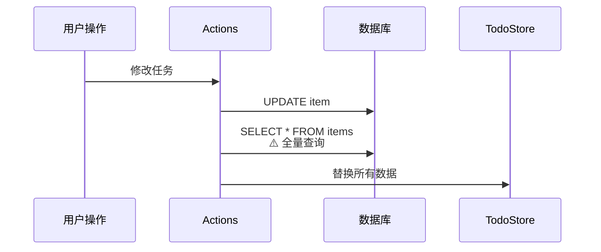
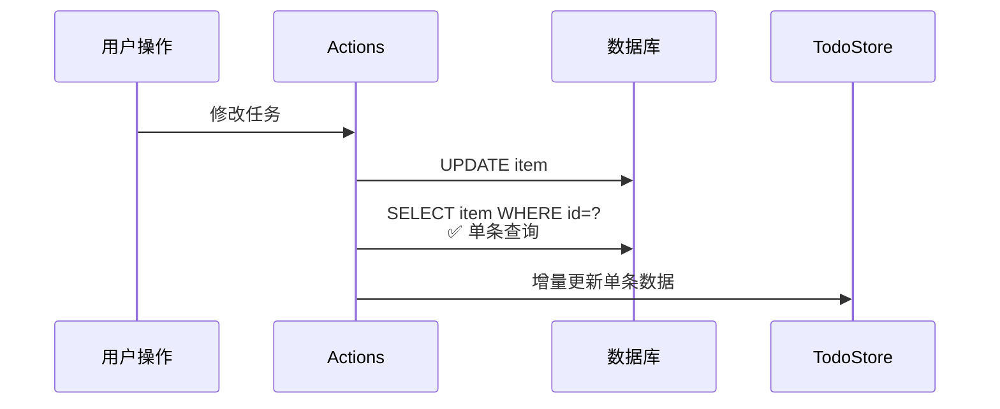

# Mytool-GPUI 优化方案

## 📋 概述

本文档基于对项目架构的全面分析，提出项目结构优化和性能优化方案。建议按优先级逐步实施。

---

## 📊 当前架构分析

### 架构概览



### 已完成的优化

根据 `refactor_plan.md`，以下优化已完成：

| 优化项           | 状态 | 效果                          |
| ---------------- | ---- | ----------------------------- |
| 统一状态管理     | ✅   | TodoStore 替代 6 个分散状态   |
| 统一写入路径     | ✅   | 一次修改只触发 1-2 次 DB 查询 |
| Board 视图迁移   | ✅   | 所有 Board 使用 TodoStore     |
| 提取通用渲染组件 | ✅   | board_renderer.rs 减少重复    |

---

## ⚠️ 发现的问题

### 问题 1：遗留状态冗余（霰弹式修改）



**位置**：`crates/mytool/src/todo_state/mod.rs:70-86`

**影响**：增加维护负担，可能导致状态不一致

---

### 问题 2：数据模型设计问题（基本类型偏执）

**位置**：`crates/todos/src/entity/items.rs`

```rust
// 问题：due 字段使用 Option<serde_json::Value>，缺乏类型安全
pub due: Option<serde_json::Value>,

// 问题：labels 使用 String 存储，应该是关联表
pub labels: Option<String>,  // 用分号分隔的 ID 字符串
```

**影响**：类型不安全，查询效率低

---

### 问题 3：视图层代码重复（重复代码）

**位置**：`crates/mytool/src/views/boards/board_today.rs`

```rust
// 重复模式：每个 section 都有类似的渲染代码
.when(!pinned_items.is_empty(), |this| {
    this.child(section("Pinned").child(v_flex()...))
})
.when(!overdue_items.is_empty(), |this| {
    this.child(section("Overdue").child(v_flex()...))
})
// ... 更多类似代码
```

**影响**：代码冗余，维护困难

---

### 问题 4：服务层职责不清（发散式变化）



**影响**：职责模糊，难以维护

---

### 问题 5：缓存与状态管理冲突

| 位置         | 类型     | 用途         |
| ------------ | -------- | ------------ |
| CacheManager | LRU 缓存 | 单项查询缓存 |
| TodoStore    | 全量内存 | 全局状态管理 |

**影响**：两套缓存可能导致数据不一致

---

## 🏗️ 项目结构优化方案

### 方案 1：清理遗留状态结构

**优先级**：🔴 高

**目标**：移除不再使用的状态结构，简化代码

**步骤**：

1. 移除以下文件：
   - `crates/mytool/src/todo_state/item_inbox.rs`
   - `crates/mytool/src/todo_state/item_today.rs`
   - `crates/mytool/src/todo_state/item_scheduled.rs`
   - `crates/mytool/src/todo_state/item_pinned.rs`
   - `crates/mytool/src/todo_state/item_completed.rs`

2. 更新 `crates/mytool/src/todo_state/mod.rs`：

```rust
mod database;
mod item;
mod label;
mod project;
mod section;
mod todo_store;

pub use database::*;
use gpui::App;
pub use item::*;
pub use label::*;
pub use project::*;
pub use section::*;
pub use todo_store::*;

/// 初始化所有状态
pub fn state_init(cx: &mut App) {
    // 初始化统一的 TodoStore（唯一数据源）
    cx.set_global(TodoStore::new());

    // 异步初始化数据库连接并加载数据
    cx.spawn(async move |cx| {
        let db = get_todo_conn().await;
        let items = crate::service::load_items(db.clone()).await;
        let projects = crate::service::load_projects(db.clone()).await;
        let sections = crate::service::load_sections(db.clone()).await;

        let _ = cx.update_global::<TodoStore, _>(|store, _| {
            store.set_items(items);
            store.set_projects(projects);
            store.set_sections(sections);
        });

        let _ = cx.update(|cx| {
            cx.set_global::<DBState>(DBState { conn: db });
        });
    })
    .detach();

    // 初始化其他状态
    cx.set_global(ProjectState::new());
    cx.set_global(LabelState::new());
    cx.set_global(SectionState::new());
}
```

3. 更新所有引用到 `TodoStore`

**预期效果**：

- 减少约 500 行代码
- 消除状态不一致风险
- 简化维护

---

### 方案 2：重构数据模型

**优先级**：🟢 低（工作量大）

**目标**：提高类型安全性和查询效率

**步骤**：

1. 创建强类型的 DueDate 结构：

```rust
// crates/todos/src/objects/due_date.rs
use chrono::NaiveDateTime;
use serde::{Deserialize, Serialize};

#[derive(Clone, Debug, Serialize, Deserialize)]
pub struct DueDate {
    pub date: NaiveDateTime,
    pub timezone: Option<String>,
    pub is_recurring: bool,
    pub recurrency_type: Option<RecurrencyType>,
    pub recurrency_interval: Option<i32>,
    pub recurrency_weeks: Option<Vec<i32>>,
    pub recurrency_count: Option<i32>,
    pub recurrency_end: Option<RecurrencyEndType>,
}

impl DueDate {
    pub fn new(date: NaiveDateTime) -> Self {
        Self {
            date,
            timezone: None,
            is_recurring: false,
            recurrency_type: None,
            recurrency_interval: None,
            recurrency_weeks: None,
            recurrency_count: None,
            recurrency_end: None,
        }
    }

    pub fn is_overdue(&self) -> bool {
        self.date < chrono::Utc::now().naive_utc()
    }

    pub fn is_due_today(&self) -> bool {
        self.date.date() == chrono::Utc::now().naive_utc().date()
    }
}
```

2. 创建 item_labels 关联表：

```sql
-- schema.sql
CREATE TABLE item_labels (
    item_id TEXT NOT NULL,
    label_id TEXT NOT NULL,
    PRIMARY KEY (item_id, label_id),
    FOREIGN KEY (item_id) REFERENCES items(id) ON DELETE CASCADE,
    FOREIGN KEY (label_id) REFERENCES labels(id) ON DELETE CASCADE
);

CREATE INDEX idx_item_labels_item ON item_labels(item_id);
CREATE INDEX idx_item_labels_label ON item_labels(label_id);
```

3. 更新 ItemModel：

```rust
// crates/todos/src/entity/items.rs
#[derive(Clone, Debug, PartialEq, DeriveEntityModel, Eq, Serialize, Deserialize)]
#[sea_orm(table_name = "items")]
pub struct Model {
    // ... 其他字段

    #[sea_orm(column_type = "Json", nullable)]
    pub due: Option<DueDate>,  // 强类型替代 serde_json::Value

    // 移除 labels 字段，使用关联表
}
```

**预期效果**：

- 类型安全
- 查询效率提升
- 数据一致性更好

---

### 方案 3：统一视图渲染组件

**优先级**：🟡 中

**目标**：减少 Board 组件的重复代码

**步骤**：

1. 激活 `board_renderer.rs` 组件：

```rust
// crates/mytool/src/views/boards/board_renderer.rs

use std::sync::Arc;
use gpui::{
    Context, Entity, Hsla, InteractiveElement, IntoElement, MouseButton,
    ParentElement, Render, StatefulInteractiveElement, Styled, Window, div,
    prelude::FluentBuilder,
};
use gpui_component::{
    ActiveTheme, IconName, Sizable,
    button::{Button, ButtonVariants},
    h_flex, v_flex,
};
use todos::entity::ItemModel;
use crate::{ItemRow, ItemRowState, section};

/// Board 配置结构
pub struct BoardConfig {
    pub title: &'static str,
    pub description: &'static str,
    pub icon: IconName,
    pub colors: Vec<Hsla>,
}

/// 渲染 Board 头部
pub fn render_board_header(
    config: &BoardConfig,
    on_add: impl Fn(&mut Window, &mut gpui::App) + 'static,
    on_edit: impl Fn(&mut Window, &mut gpui::App) + 'static,
    on_delete: impl Fn(&mut Window, &mut gpui::App) + 'static,
    view: Entity<impl gpui::Render>,
    cx: &mut gpui::App,
) -> impl IntoElement {
    h_flex()
        .border_b_1()
        .border_color(cx.theme().border)
        .justify_between()
        .items_start()
        .child(
            v_flex()
                .child(
                    h_flex()
                        .gap_2()
                        .child(config.icon)
                        .child(div().text_base().child(config.title)),
                )
                .child(
                    div()
                        .text_sm()
                        .text_color(cx.theme().muted_foreground)
                        .child(config.description),
                ),
        )
        .child(render_action_buttons(on_add, on_edit, on_delete, view))
}

/// 渲染操作按钮
fn render_action_buttons(
    on_add: impl Fn(&mut Window, &mut gpui::App) + 'static,
    on_edit: impl Fn(&mut Window, &mut gpui::App) + 'static,
    on_delete: impl Fn(&mut Window, &mut gpui::App) + 'static,
    view: Entity<impl gpui::Render>,
) -> impl IntoElement {
    div()
        .flex()
        .items_center()
        .justify_end()
        .px_2()
        .gap_2()
        .on_mouse_down(MouseButton::Left, |_, _, cx| cx.stop_propagation())
        .child(
            Button::new("add-label")
                .small()
                .ghost()
                .compact()
                .icon(IconName::PlusLargeSymbolic)
                .on_click(move |_event, window, cx| on_add(window, cx)),
        )
        .child(
            Button::new("edit-item")
                .small()
                .ghost()
                .compact()
                .icon(IconName::EditSymbolic)
                .on_click(move |_event, window, cx| on_edit(window, cx)),
        )
        .child(
            Button::new("delete-item")
                .icon(IconName::UserTrashSymbolic)
                .small()
                .ghost()
                .on_click(move |_event, window, cx| on_delete(window, cx)),
        )
}

/// 渲染项目列表
pub fn render_item_list(
    items: &[(usize, Arc<ItemModel>)],
    item_rows: &[Entity<ItemRowState>],
    active_index: Option<usize>,
    view: Entity<impl gpui::Render>,
) -> impl IntoElement {
    v_flex()
        .gap_2()
        .w_full()
        .children(items.iter().map(|(i, _item)| {
            let view = view.clone();
            let is_active = active_index == Some(*i);
            let item_row = item_rows.get(*i).cloned();
            div()
                .id(("item", *i))
                .on_click(move |_, _, cx| {
                    view.update(cx, |this, cx| {
                        // 更新 active_index
                        cx.notify();
                    });
                })
                .when(is_active, |this| {
                    this.border_color(gpui::transparent_black())
                })
                .children(item_row.map(|row| ItemRow::new(&row)))
        }))
}

/// 渲染带标题的区域
pub fn render_item_section(
    title: &str,
    items: &[(usize, Arc<ItemModel>)],
    item_rows: &[Entity<ItemRowState>],
    active_index: Option<usize>,
    view: Entity<impl gpui::Render>,
) -> impl IntoElement {
    section(title).child(render_item_list(items, item_rows, active_index, view))
}
```

2. 更新 Board 组件使用新渲染器：

```rust
// crates/mytool/src/views/boards/board_today.rs
impl Render for TodayBoard {
    fn render(&mut self, _window: &mut Window, cx: &mut Context<Self>) -> impl IntoElement {
        let config = BoardConfig {
            title: "Today",
            description: "今天需要完成的任务",
            icon: IconName::StarOutlineThickSymbolic,
            colors: vec![gpui::rgb(0x33d17a).into()],
        };

        v_flex()
            .track_focus(&self.base.focus_handle)
            .size_full()
            .gap_4()
            .child(render_board_header(
                &config,
                |w, cx| self.show_item_dialog(w, cx, false, None),
                |w, cx| self.show_item_dialog(w, cx, true, None),
                |w, cx| self.show_item_delete_dialog(w, cx),
                cx.entity().clone(),
                cx,
            ))
            .child(
                v_flex().flex_1().overflow_y_scrollbar()
                    .when(!self.base.pinned_items.is_empty(), |this| {
                        this.child(render_item_section(
                            "Pinned",
                            &self.base.pinned_items,
                            &self.base.item_rows,
                            self.base.active_index,
                            cx.entity().clone(),
                        ))
                    })
                    // ... 其他 sections
            )
    }
}
```

**预期效果**：

- 减少约 300 行重复代码
- 统一 UI 风格
- 便于维护

---

### 方案 4：明确服务层职责

**优先级**：🟡 中

**目标**：清晰划分服务层职责

**推荐架构**：



**步骤**：

1. 重命名和重组服务：

```
crates/mytool/src/
├── state_service/        # 重命名 service
│   ├── mod.rs
│   ├── item_state.rs     # 与 GPUI 状态交互
│   └── project_state.rs
└── todo_actions/         # 保持不变

crates/todos/src/
├── services/             # 纯业务逻辑
│   ├── item_service.rs   # 移除 GPUI 依赖
│   └── ...
└── objects/              # 纯数据结构
    ├── item.rs           # 移除业务逻辑方法
    └── ...
```

2. 更新职责划分：

| 层级            | 职责                       | 示例                           |
| --------------- | -------------------------- | ------------------------------ |
| Views           | UI 渲染和用户交互          | board_today.rs                 |
| Actions         | 业务操作入口，触发状态更新 | todo_actions/item.rs           |
| StateService    | 与 GPUI 状态交互           | state_service/item_state.rs    |
| BusinessService | 纯业务逻辑                 | todos/services/item_service.rs |
| Repository      | 数据访问                   | todos/repositories/            |

**预期效果**：

- 职责清晰
- 便于测试
- 降低耦合

---

## ⚡ 性能优化方案

### 方案 5：增量更新机制

**优先级**：🔴 高

**目标**：从全量刷新改为增量更新

**当前问题**：



**优化方案**：



**实现步骤**：

1. 更新 TodoStore：

```rust
// crates/mytool/src/todo_state/todo_store.rs

impl TodoStore {
    /// 增量更新单个任务
    pub fn update_item(&mut self, item: Arc<ItemModel>) {
        if let Some(pos) = self.all_items.iter().position(|i| i.id == item.id) {
            self.all_items[pos] = item;
        } else {
            self.all_items.push(item);
        }
    }

    /// 删除单个任务
    pub fn remove_item(&mut self, id: &str) {
        self.all_items.retain(|i| i.id != id);
    }

    /// 添加单个任务
    pub fn add_item(&mut self, item: Arc<ItemModel>) {
        self.all_items.push(item);
    }

    /// 批量增量更新
    pub fn apply_changes(&mut self, added: Vec<Arc<ItemModel>>, updated: Vec<Arc<ItemModel>>, deleted: Vec<String>) {
        for item in added {
            self.all_items.push(item);
        }
        for item in updated {
            if let Some(pos) = self.all_items.iter().position(|i| i.id == item.id) {
                self.all_items[pos] = item;
            }
        }
        for id in deleted {
            self.all_items.retain(|i| i.id != id);
        }
    }
}
```

2. 更新 store_actions：

```rust
// crates/mytool/src/todo_actions/store_actions.rs

/// 增量更新任务（只更新单条数据）
pub async fn update_item_incremental(
    item: Arc<ItemModel>,
    cx: &mut AsyncApp,
    db: DatabaseConnection,
) {
    match crate::service::mod_item(item.clone(), db).await {
        Ok(updated_item) => {
            let _ = cx.update_global::<TodoStore, _>(|store, _| {
                store.update_item(Arc::new(updated_item));
            });
        },
        Err(e) => {
            tracing::error!("update_item failed: {:?}", e);
        },
    }
}

/// 增量删除任务
pub async fn delete_item_incremental(
    item_id: String,
    cx: &mut AsyncApp,
    db: DatabaseConnection,
) {
    match crate::service::del_item_by_id(&item_id, db).await {
        Ok(_) => {
            let _ = cx.update_global::<TodoStore, _>(|store, _| {
                store.remove_item(&item_id);
            });
        },
        Err(e) => {
            tracing::error!("delete_item failed: {:?}", e);
        },
    }
}
```

**预期效果**：

- 数据传输量减少 90%+
- 响应速度提升
- 降低数据库负载

---

### 方案 6：数据库查询优化

**优先级**：🟡 中

**目标**：提升查询性能

**步骤**：

1. 添加数据库索引：

```sql
-- 添加到 schema.sql 或执行迁移

-- 项目查询索引
CREATE INDEX IF NOT EXISTS idx_items_project_id ON items(project_id);
CREATE INDEX IF NOT EXISTS idx_items_section_id ON items(section_id);

-- 状态查询索引
CREATE INDEX IF NOT EXISTS idx_items_checked ON items(checked);
CREATE INDEX IF NOT EXISTS idx_items_pinned ON items(pinned);

-- 日期查询索引（JSON 字段需要特殊处理）
CREATE INDEX IF NOT EXISTS idx_items_due ON items(due);

-- 复合索引
CREATE INDEX IF NOT EXISTS idx_items_project_checked ON items(project_id, checked);
CREATE INDEX IF NOT EXISTS idx_items_due_checked ON items(due, checked);
```

2. 优化查询语句：

```rust
// crates/todos/src/services/item_service.rs

/// 获取今日到期任务（优化版）
pub async fn get_items_due_today_optimized(&self) -> Result<Vec<ItemModel>, TodoError> {
    let today = chrono::Utc::now().naive_utc().date();
    let today_start = today.and_hms_opt(0, 0, 0).unwrap();
    let today_end = today.and_hms_opt(23, 59, 59).unwrap();

    // 使用参数化查询，避免全表扫描
    let items = ItemEntity::find()
        .filter(items::Column::Checked.eq(false))
        .filter(items::Column::Due.is_not_null())
        .all(&*self.db)
        .await?;

    // 在内存中过滤日期（因为 due 是 JSON 字段）
    Ok(items.into_iter().filter(|item| {
        Self::is_due_in_range(&item.due, today_start, today_end)
    }).collect())
}
```

**预期效果**：

- 查询速度提升 50%+
- 减少数据库负载

---

### 方案 7：虚拟列表渲染

**优先级**：🟢 低

**目标**：大数据量时的渲染优化

**实现**：

```rust
// 使用 GPUI 的虚拟列表组件
use gpui_component::list::{List, ListState};

pub struct ItemListPanel {
    list: Entity<ListState<ItemListDelegate>>,
}

impl ItemListPanel {
    pub fn new(window: &mut Window, cx: &mut Context<Self>) -> Self {
        let delegate = ItemListDelegate::new();
        let list = cx.new(|cx| {
            ListState::new(delegate, window, cx)
                .virtualize(true)           // 启用虚拟滚动
                .item_height(px(48.0))      // 固定行高
                .overscan(5)                // 预渲染 5 条
        });

        Self { list }
    }
}
```

**预期效果**：

- 支持数万条数据流畅滚动
- 内存占用稳定

---

### 方案 8：缓存策略优化

**优先级**：🟢 低

**目标**：统一缓存管理

**推荐方案**：移除 CacheManager，统一使用 TodoStore

```rust
// 移除 crates/todos/src/services/cache_manager.rs
// 所有缓存逻辑集中在 TodoStore

impl TodoStore {
    /// 带缓存的单项查询
    pub fn get_item(&self, id: &str) -> Option<Arc<ItemModel>> {
        self.all_items.iter().find(|i| i.id == id).cloned()
    }

    /// 批量查询
    pub fn get_items_by_ids(&self, ids: &[String]) -> Vec<Arc<ItemModel>> {
        self.all_items.iter()
            .filter(|i| ids.contains(&i.id))
            .cloned()
            .collect()
    }
}
```

**预期效果**：

- 消除缓存不一致问题
- 简化代码

---

## 📊 优化优先级总览

| 优先级 | 方案           | 预期效果          | 工作量 | 风险 |
| ------ | -------------- | ----------------- | ------ | ---- |
| 🔴 高  | 增量更新机制   | 减少 90% 数据传输 | 中     | 低   |
| 🔴 高  | 清理遗留状态   | 减少维护成本      | 低     | 低   |
| 🟡 中  | 数据库索引     | 查询提速 50%+     | 低     | 低   |
| 🟡 中  | 统一视图渲染   | 减少代码重复      | 中     | 中   |
| 🟡 中  | 明确服务层职责 | 提高可维护性      | 中     | 中   |
| 🟢 低  | 数据模型重构   | 类型安全          | 高     | 高   |
| 🟢 低  | 虚拟列表       | 大数据渲染优化    | 中     | 低   |
| 🟢 低  | 缓存策略优化   | 简化代码          | 低     | 中   |

---

## 📅 实施计划建议

### 第一阶段（1-2 周）

1. 清理遗留状态结构
2. 添加数据库索引
3. 实现增量更新机制

### 第二阶段（2-3 周）

4. 统一视图渲染组件
5. 明确服务层职责

### 第三阶段（按需）

6. 数据模型重构
7. 虚拟列表渲染
8. 缓存策略优化

---

## 📝 变更日志

| 日期       | 版本 | 说明     |
| ---------- | ---- | -------- 