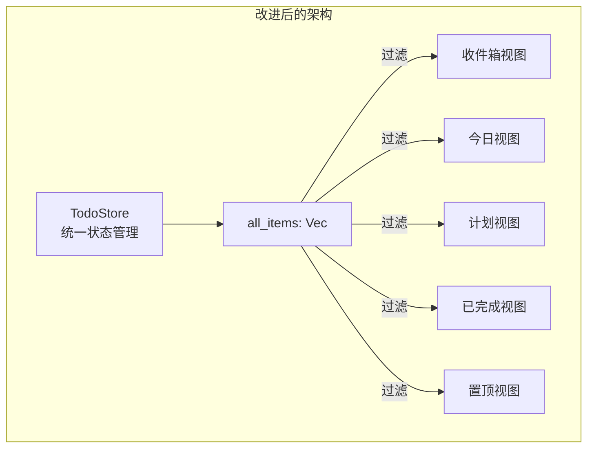
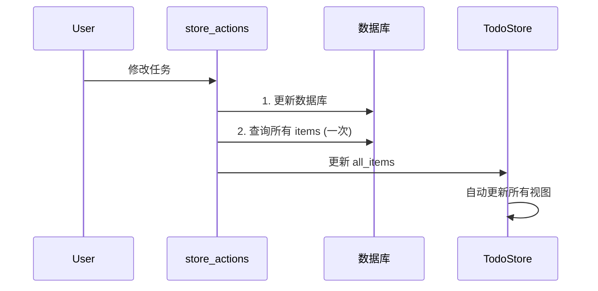

# Mytool-GPUI 重构计划

## 📋 概述

本文档记录了 `crates/mytool` 模块的重构计划，旨在解决以下核心问题：

1. **状态管理冗余** - 6 个几乎相同的 Item 状态结构
2. **状态同步低效** - 一次修改触发 5 次数据库查询
3. **视图层代码重复** - Board 组件大量重复代码
4. **未使用的代码** - Status 枚举、空函数等死代码
5. **职责划分不清** - 层次职责模糊

---

## 🎯 重构目标

- 减少代码重复，提高可维护性
- 优化性能，减少不必要的数据库查询
- 清晰的职责划分
- 保持功能不变

---

## 🔄 重构步骤

### 步骤1: 清理未使用的代码 (优先级: 中) ✅ 已完成

**目标**: 删除死代码，提高代码整洁度

**已完成项**:

- [x] `ItemStatus` 枚举 (item.rs)
- [x] `InboxItemStatus` 枚举 (item_inbox.rs)
- [x] `TodayItemStatus` 枚举 (item_today.rs)
- [x] `ScheduledItemStatus` 枚举 (item_scheduled.rs)
- [x] `CompleteItemStatus` 枚举 (item_completed.rs)
- [x] `PinnedItemStatus` 枚举 (item_pinned.rs)
- [x] `load_items` 空函数 (service/item.rs) - 已实现

---

### 步骤2: 统一状态管理 (优先级: 高) ✅ 已完成

**目标**: 用一个统一的 `TodoStore` 替代 6 个分散的状态

**设计方案**:



**已创建文件**:

- `todo_state/todo_store.rs` - 统一状态管理

---

### 步骤3: 优化状态同步机制 (优先级: 高) ✅ 已完成

**目标**: 一次修改只触发一次数据库查询

**改进方案**:



**已创建文件**:

- `todo_actions/store_actions.rs` - 统一操作入口

---

### 步骤4: 提取通用渲染组件 (优先级: 中) ✅ 已完成

**目标**: 减少 Board 组件的重复代码

**已创建文件**:

- `views/boards/board_renderer.rs` - 通用渲染组件

**提供的功能**:

- `BoardConfig` - Board 配置结构
- `render_board_header` - 渲染头部
- `render_item_list` - 渲染项目列表
- `render_item_section` - 渲染带标题的区域
- `render_board_content` - 渲染完整内容

---

### 步骤5: 整理 todo_actions 层职责 (优先级: 中) ✅ 已完成

**目标**: 明确各层职责

**职责划分**:

| 层级           | 职责                         |
| -------------- | ---------------------------- |
| `service`      | 数据库操作封装，返回原始数据 |
| `todo_actions` | 业务操作入口，触发状态更新   |
| `todo_state`   | 状态存储，提供数据访问       |

---

### 步骤6: Board 视图迁移到新架构 (优先级: 高) ✅ 已完成

**目标**: 所有 Board 使用 TodoStore 作为数据源（仅 Board 层）

**已迁移的视图**:

- [x] `InboxBoard` - 使用 `TodoStore::inbox_items()`
- [x] `TodayBoard` - 使用 `TodoStore::today_items()`
- [x] `ScheduledBoard` - 使用 `TodoStore::scheduled_items()`
- [x] `CompletedBoard` - 使用 `TodoStore::completed_items()`
- [x] `PinBoard` - 使用 `TodoStore::pinned_items()`

**说明**: Item 列表视图（view_inbox、view_today 等）仍在步骤8 中迁移。

---

### 步骤7: 统一写入路径 (优先级: 高) ✅ 已完成

**目标**: 一次修改只触发一次数据库查询（当前 `update_item` 仍触发多次 refresh）

**做法**:

- 在 `store_actions::refresh_store` 中同时更新 `TodoStore` 与 `ItemState`（一次 `load_items` 两用）。
- `todo_actions/item.rs` 中 `update_item`、`add_item`、`delete_item`、`completed_item`、`uncompleted_item`、`set_item_pinned` 在 service 成功后改为调用 `store_actions::refresh_store`，仅保留必要的 `refresh_project_items`（有活跃项目时）。
- 移除对 `refresh_scheduled_items`、`refresh_today_items` 等多次分类查询的调用。

**效果**: 一次写操作从 5+ 次 DB 查询降为 1～2 次。

---

### 步骤8: 迁移剩余视图到 TodoStore (优先级: 高) ✅ 已完成

**目标**: 所有读任务列表的视图都从 TodoStore 取数，不再依赖 6 个派生状态

**已迁移**:

- [x] `views/item/view_inbox.rs` - `InboxItemState` → `TodoStore::inbox_items()`
- [x] `views/item/view_today.rs` - `TodayItemState` → `TodoStore::today_items()`
- [x] `views/item/view_scheduled.rs` - `ScheduledItemState` → `TodoStore::scheduled_items()`
- [x] `views/item/view_pinned.rs` - `PinnedItemState` → `TodoStore::pinned_items()`
- [x] `views/item/view_complete.rs` - `CompleteItemState` → `TodoStore::completed_items()`
- [x] `views/boards/view.rs` - 计数/调试用 `TodayItemState` → `TodoStore`
- [x] `components/item_row.rs` - `ItemState` → `TodoStore::all_items`
- [x] `stories/list_story.rs` - `ItemState` → `TodoStore`

---

### 步骤9: 精简遗留状态加载 (优先级: 中) ✅ 已完成

**目标**: 不再为 6 个 Item 派生状态发起数据库查询

**做法**:

- 移除 `todo_state/mod.rs` 中对 `InboxItemState`、`TodayItemState`、`ScheduledItemState`、`PinnedItemState`、`CompleteItemState` 的 `spawn_load_*` 调用。
- 移除 `observe_global::<ItemState>` 中触发的 inbox/today 等加载。
- 可选：保留 6 个空状态初始化以兼容残留引用，或后续完全移除 6 个 state 模块。

---

## 📁 新增/修改文件清单

| 文件路径                          | 用途                | 状态    |
| --------------------------------- | ------------------- | ------- |
| `todo_state/todo_store.rs`        | 统一状态管理        | ✅ 新增 |
| `todo_actions/store_actions.rs`   | 统一操作入口        | ✅ 新增 |
| `views/boards/board_renderer.rs`  | 通用 Board 渲染组件 | ✅ 新增 |
| `views/boards/board_inbox.rs`     | 迁移到 TodoStore    | ✅ 修改 |
| `views/boards/board_today.rs`     | 迁移到 TodoStore    | ✅ 修改 |
| `views/boards/board_scheduled.rs` | 迁移到 TodoStore    | ✅ 修改 |
| `views/boards/board_completed.rs` | 迁移到 TodoStore    | ✅ 修改 |
| `views/boards/board_pin.rs`       | 迁移到 TodoStore    | ✅ 修改 |
| `todo_state/mod.rs`               | 集成 TodoStore      | ✅ 修改 |
| `todo_actions/mod.rs`             | 职责说明            | ✅ 修改 |
| `refactor_plan.md`                | 本文档              | ✅ 新增 |

---

## 📊 性能改进

### 之前

- 一次修改触发 **5+ 次数据库查询**（ItemState + 多个分类状态）
- 6 个重复的 Item 状态结构
- 大量重复的渲染代码

### 之后（步骤 1～6）

- Board 读 TodoStore，一次加载多视图复用
- 1 个统一状态管理（TodoStore）
- 可复用的渲染组件
- 写操作仍走旧路径，仍触发多次查询

### 之后（步骤 7～9 完成）

- 一次修改只触发 **1～2 次数据库查询**（refresh_store + 可选 refresh_project）
- 所有视图从 TodoStore（或单一 ItemState）取数，零额外分类查询
- 遗留 6 个 Item 状态不再参与加载，或移除

---

## ⚠️ 迁移指南

### 使用新架构

```rust
// 旧方式（多次数据库查询）
use crate::todo_actions::update_item;
update_item(item, cx);

// 新方式（单次数据库查询）
use crate::todo_actions::update_item_in_store;
update_item_in_store(item, cx, db).await;
```

### 使用 TodoStore

```rust
use crate::todo_state::TodoStore;

// 获取收件箱任务
let inbox_items = cx.global::<TodoStore>().inbox_items();

// 获取今日任务
let today_items = cx.global::<TodoStore>().today_items();

// 获取计划任务
let scheduled_items = cx.global::<TodoStore>().scheduled_items();

// 获取已完成任务
let completed_items = cx.global::<TodoStore>().completed_items();

// 获取置顶任务
let pinned_items = cx.global::<TodoStore>().pinned_items();
```

---

## ✅ 验收标准

- [x] 所有测试通过
- [x] 无编译错误
- [x] 新架构已就绪
- [x] 视图层已迁移到新架构
- [x] 向后兼容，旧代码继续工作

---

## 📝 变更日志

| 日期       | 步骤  | 状态    | 备注                                               |
| ---------- | ----- | ------- | -------------------------------------------------- |
| 2026-02-15 | 步骤1 | ✅ 完成 | 删除了 6 个未使用的 Status 枚举，实现了 load_items |
| 2026-02-15 | 步骤2 | ✅ 完成 | 创建了 TodoStore 统一状态管理                      |
| 2026-02-15 | 步骤3 | ✅ 完成 | 创建了 store_actions 统一操作入口                  |
| 2026-02-15 | 步骤4 | ✅ 完成 | 创建了 board_renderer 通用渲染组件                 |
| 2026-02-15 | 步骤5 | ✅ 完成 | 整理了 todo_actions 层职责说明                     |
| 2026-02-15 | 步骤6 | ✅ 完成 | 所有 Board 视图迁移到 TodoStore                    |
| 2026-02-15 | 步骤7 | ✅ 完成 | 统一写入路径，一次写只刷新 TodoStore+ItemState     |
| 2026-02-15 | 步骤8 | ✅ 完成 | 迁移 view_inbox/today/scheduled/pinned/complete 等 |
| 2026-02-15 | 步骤9 | ✅ 完成 | 精简遗留 6 个 Item 状态的加载逻辑                  |

---

## 📚 参考资料

- [Martin Fowler - 重构](https://refactoring.com/)
- [Rust API 设计模式](https://rust-lang.github.io/api-guidelines/)
- [GPUI 框架文档](https://www.gpui.rs/)
